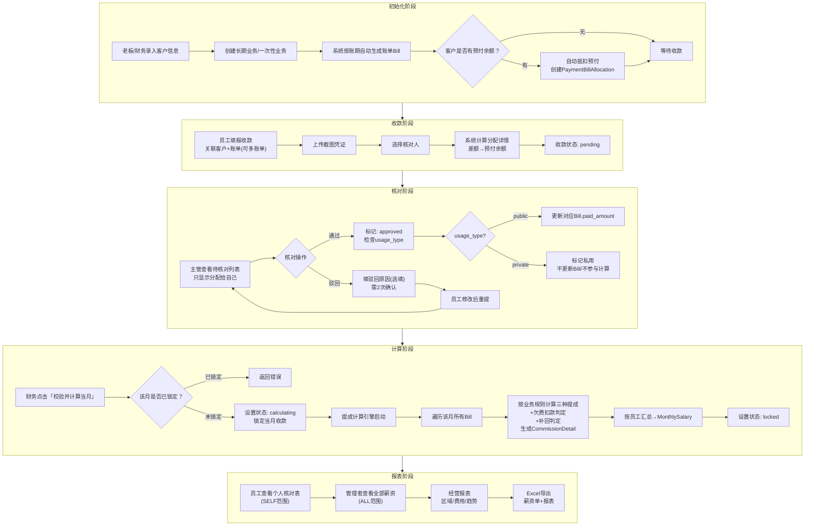
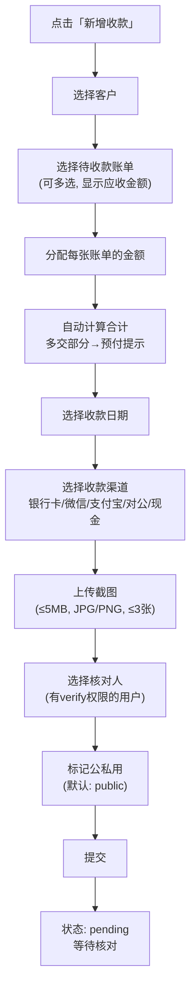
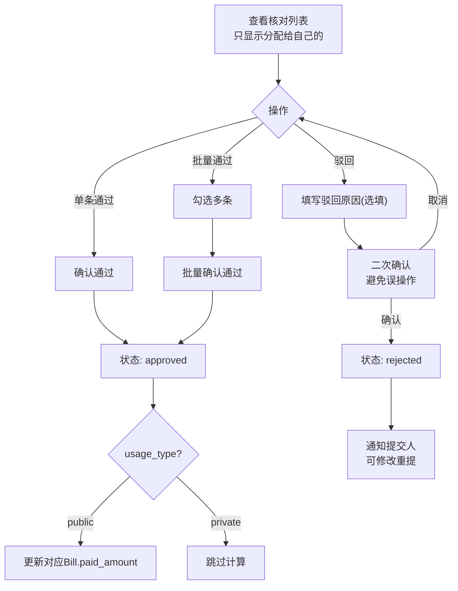
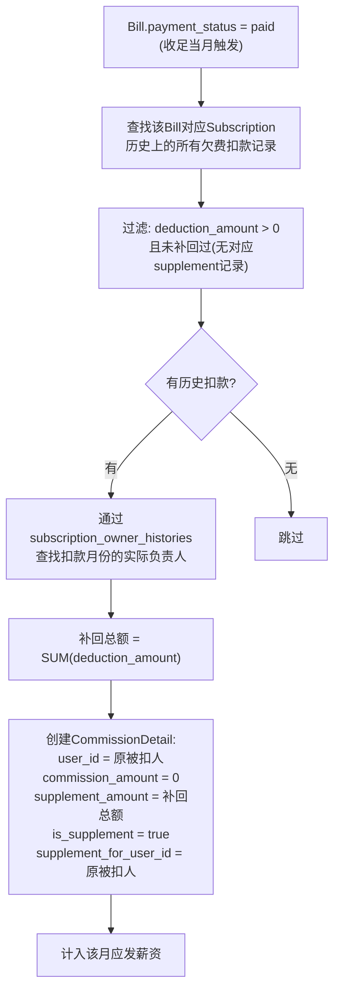
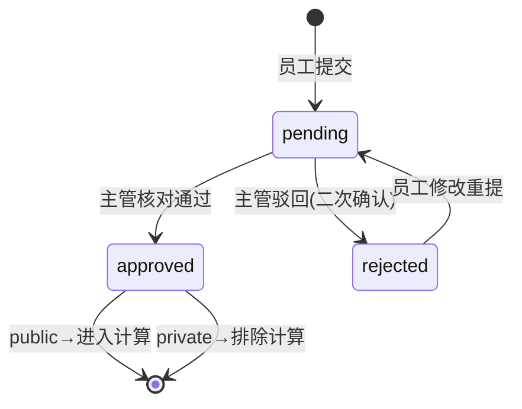
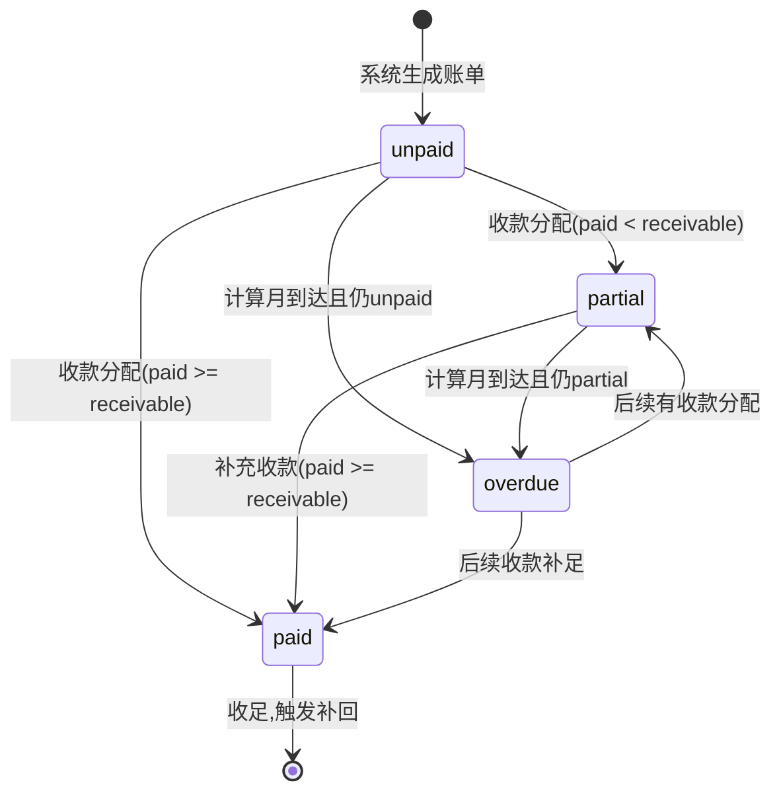
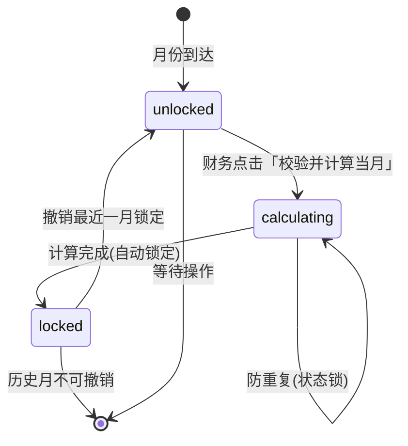
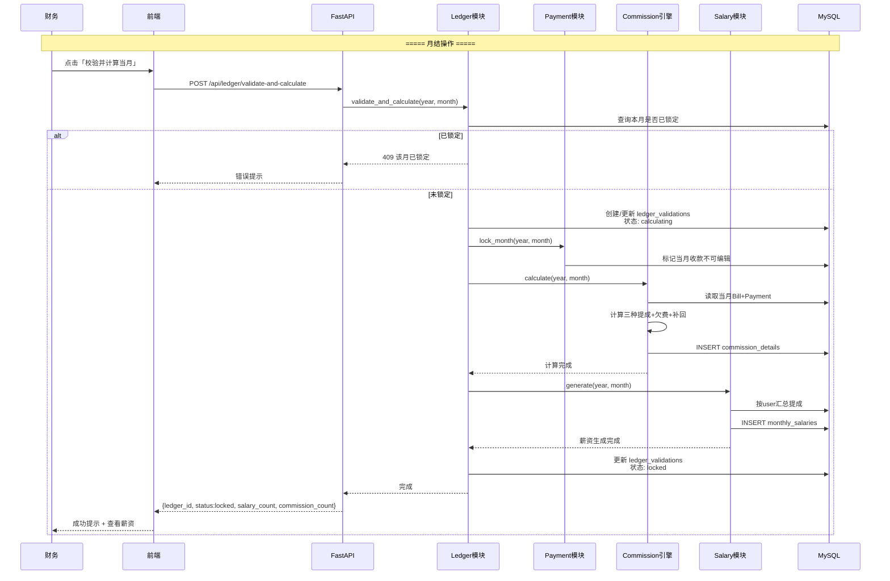
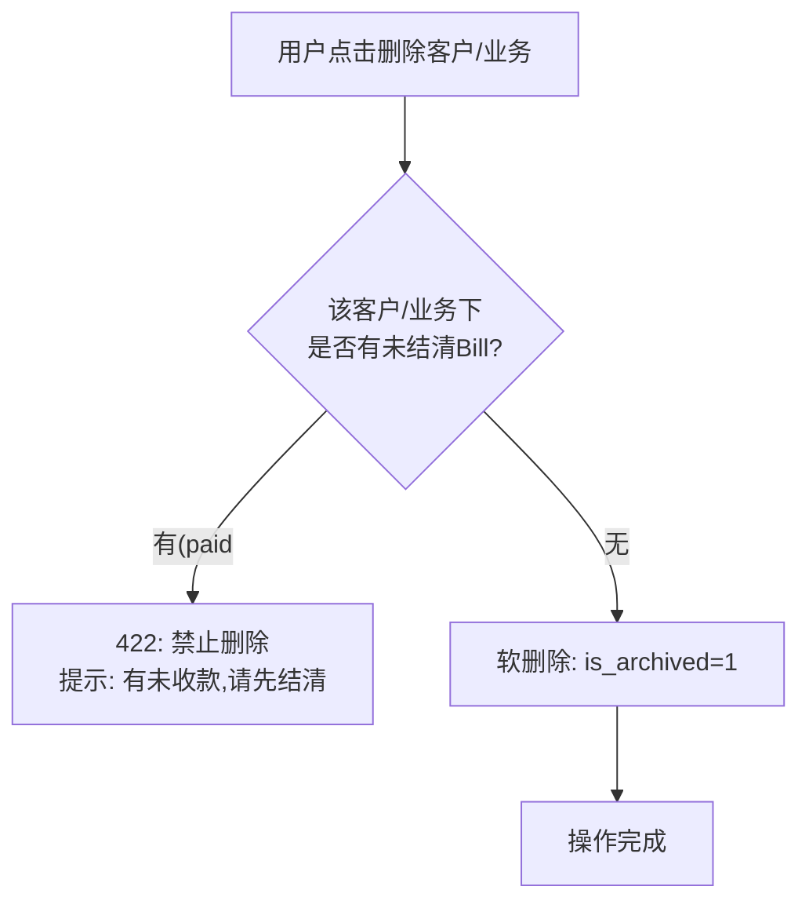
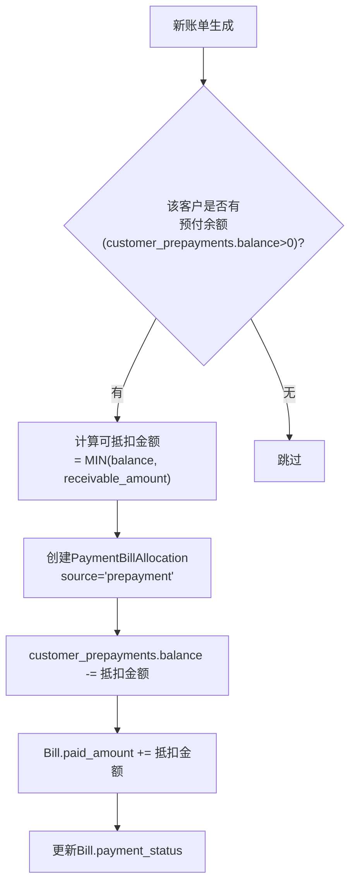

# 薪资管理工具 — 业务流程设计文档

> 文档状态：v3
> 对应设计步骤：第 7 步 — 业务流程、单据状态机设计
> 基础文档：SRS v3、整体设计文档、数据库设计文档

---

## 1. 核心业务流程图

### 1.1 端到端主流程



### 1.2 收款填报流程（移动端核心）



### 1.3 核对流程



### 1.4 提成计算引擎详细流程

```mermaid
flowchart TD
    START["ledger模块触发<br/>calculate(year, month)"] --> LOCK["锁定当月收款<br/>(禁止新增/修改)"]
    LOCK --> GET_BILLS["获取当月所有Bill<br/>WHERE billing_year=year<br/>AND billing_month=month"]
    GET_BILLS --> ITER["遍历每张Bill"]

    ITER --> TYPE_CHECK{"bill_type?"}

    TYPE_CHECK -- "subscription" --> SUB_LOGIC["长期业务逻辑"]
    TYPE_CHECK -- "onetime" --> OT_LOGIC["一次性业务逻辑"]

    subgraph SUB_LOGIC["长期业务提成"]
        S1["获取Subscription"] --> S2["取有效月费<br/>(FeeHistory按生效日期)")
        S2 --> S3["服务提成 = 月费 × 0.15"]
        S3 --> S4{"Bill.payment_status?"}
        S4 -- "unpaid/overdue" --> S5["欠费扣款 = 月费 × 0.05<br/>创建CommissionDetail<br/>(deduction>0)"]
        S4 -- "paid" --> S6{"有历史扣款?"}
        S6 -- "有" --> S7["补回总额 = 历史所有扣款<br/>创建CommissionDetail<br/>(is_supplement=true)"]
        S6 -- "无" --> S8["正常计提<br/>no deduction"]
        S4 -- "partial" --> S9["正常计提<br/>no deduction<br/>no supplement"]
        S5 --> S10["检查销售提成"]
        S7 --> S10
        S8 --> S10
        S9 --> S10
        S10 --> S11{"新客+12月窗口内?"}
        S11 -- "是" --> S12["销售提成 = 当月收款 × 0.15<br/>创建CommissionDetail(type=sales)"]
        S11 -- "否" --> S13["跳过"]
    end

    subgraph OT_LOGIC["一次性业务提成"]
        O1["获取OneTimeProject"] --> O2["毛利 = revenue - cost"]
        O2 --> O3["一次性提成 = 毛利 × 0.20"]
        O3 --> O4{"is_received?"}
        O4 -- "否" --> O5["欠费扣款 = 毛利 × 0.05"]
        O4 -- "是" --> O6["正常计提<br/>no deduction"]
    end

    S12 --> NEXT
    S13 --> NEXT
    O5 --> NEXT
    O6 --> NEXT
    NEXT["下一条Bill"] -->|"继续"| ITER
    NEXT -->|"完毕"| SUMMARY["按user_id汇总<br/>生成MonthlySalary"]
    SUMMARY --> FINISH["标记计算完成"]
```

### 1.5 补回逻辑详解



---

## 2. 单据状态机

### 2.1 收款记录状态机



### 2.2 账单状态机



### 2.3 内账校验锁状态机



### 2.4 核对状态转换表

| 当前状态 | 操作 | 目标状态 | 条件 |
|---------|------|---------|------|
| pending | 通过 | approved | 核对人有 verify 权限 + 该收款分配给自己 |
| pending | 驳回 | rejected | 二次确认 |
| rejected | 修改重提 | pending | 提交人可修改 |
| approved | — | (终态) | 不可更改 |

---

## 3. 月结流程（完整）



---

## 4. 异常处理流程

### 4.1 欠款删除拦截



### 4.2 预付款自动抵扣流程



---

## 5. 风险点

| 风险 | 缓解 |
|------|------|
| 月结计算中途失败, 部分数据写入 | 整个计算过程用 DB 事务包裹, 失败回滚 |
| 并发月结触发 (状态锁绕过) | Ledger模块 checking calculating 状态 + DB 唯一约束 |
| 补回归属人查找失败 | subscription_owner_histories 覆盖所有变更, 兜底取当前负责人 |
| 预付款抵扣与收款分配冲突 | 预付款抵扣和手动分配在同一事务中顺序执行 |

---

> ✅ 业务流程设计文档完成 (v3)
