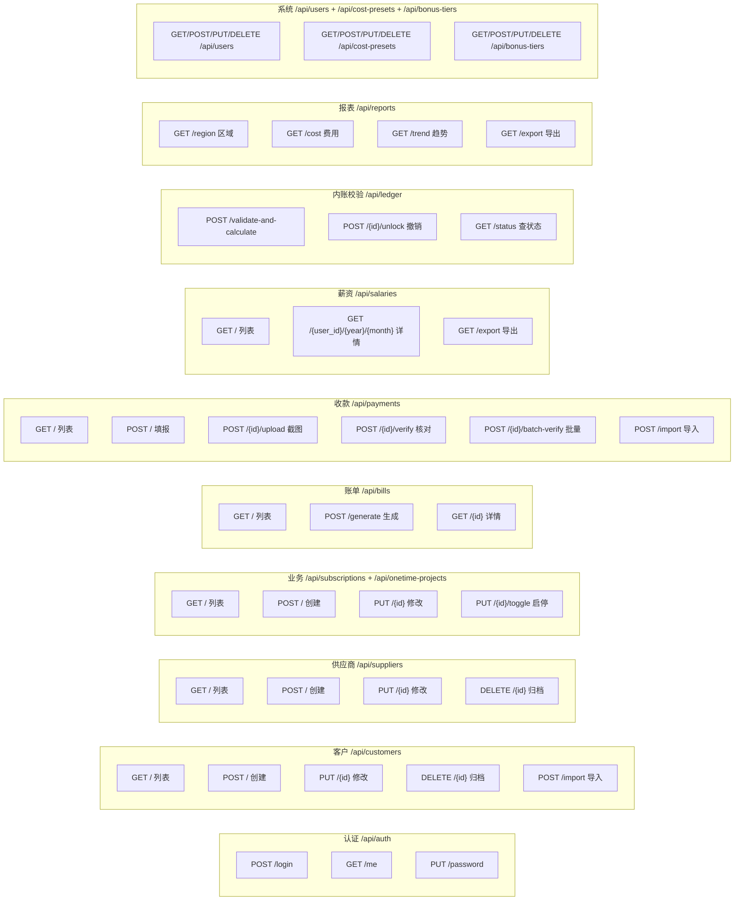

# 薪资管理工具 — 接口设计文档

> 文档状态：v3（含多对多分配 + 预付款机制）
> 对应设计步骤：第 5 步 — 前后端/服务间 API 接口设计
> 基础文档：`/workspace/需求规格说明书.md`（SRS v3）、`/workspace/整体设计文档.md`

---

## 1. API 设计规范

### 1.1 统一响应格式

```json
{
  "code": 200,
  "message": "success",
  "data": { ... }
}
```

### 1.2 统一错误响应

```json
{
  "code": 400,
  "message": "参数校验失败",
  "data": null,
  "errors": [
    { "field": "amount", "message": "金额必须大于0" }
  ]
}
```

### 1.3 统一分页格式

```json
{
  "code": 200,
  "message": "success",
  "data": {
    "items": [...],
    "total": 100,
    "page": 1,
    "page_size": 20
  }
}
```

### 1.4 错误码体系

| 错误码 | 含义 |
|-------|------|
| 200 | 成功 |
| 400 | 参数校验失败 |
| 401 | 未认证（token 无效/过期） |
| 403 | 无权限 |
| 404 | 资源不存在 |
| 409 | 冲突（如已锁定、重复提交） |
| 422 | 业务规则校验失败（如欠款不可删） |
| 500 | 服务器内部错误 |

### 1.5 认证方式

`Authorization: Bearer <jwt_token>`

---

## 2. API 端点总览



---

## 3. 详细接口定义

### 3.1 认证模块

| 方法 | 路径 | 说明 | 权限 | 请求体 | 响应 |
|------|------|------|------|--------|------|
| POST | /api/auth/login | 登录 | 公开 | `{username, password}` | `{token, user}` |
| GET | /api/auth/me | 获取当前用户 | 已登录 | — | `{id, name, permissions, data_scope}` |
| PUT | /api/auth/password | 修改密码 | 已登录 | `{old_password, new_password}` | `{success}` |

### 3.2 客户管理

| 方法 | 路径 | 说明 | 权限 | 查询参数 | 响应 |
|------|------|------|------|---------|------|
| GET | /api/customers | 客户列表 | admin:config | page, page_size, keyword, region | 分页列表 |
| POST | /api/customers | 创建客户 | admin:config | — | `{id}` |
| GET | /api/customers/{id} | 客户详情 | admin:config | — | 客户+业务列表 |
| PUT | /api/customers/{id} | 修改客户 | admin:config | — | `{success}` |
| DELETE | /api/customers/{id} | 归档客户 | admin:config | — | `{success}` 或 422（有未结清） |
| POST | /api/customers/import | Excel 导入 | admin:config | multipart file | `{success_count, error_list}` |

**客户创建请求体示例：**

```json
{
  "name": "广州XX科技有限公司",
  "region_tags": ["广州"],
  "is_new_customer": true,
  "service_start_date": "2025-03-01",
  "remark": "代理记账客户"
}
```

### 3.3 供应商管理

| 方法 | 路径 | 说明 | 权限 |
|------|------|------|------|
| GET | /api/suppliers | 供应商列表 | admin:config |
| POST | /api/suppliers | 创建 | admin:config |
| PUT | /api/suppliers/{id} | 修改 | admin:config |
| DELETE | /api/suppliers/{id} | 归档 | admin:config |

### 3.4 业务管理（长期业务）

| 方法 | 路径 | 说明 | 权限 |
|------|------|------|------|
| GET | /api/subscriptions | 长期业务列表 | salary:view |
| POST | /api/subscriptions | 创建长期业务 | admin:config |
| GET | /api/subscriptions/{id} | 详情 | salary:view |
| PUT | /api/subscriptions/{id} | 修改 | admin:config |
| PUT | /api/subscriptions/{id}/toggle | 启停 | admin:config |
| POST | /api/subscriptions/{id}/fee-change | 月费变更 | admin:config |
| GET | /api/subscriptions/{id}/fee-history | 月费变更历史 | salary:view |

**创建长期业务请求体：**

```json
{
  "company_id": 1,
  "service_type": "代理记账",
  "billing_period": "month",
  "monthly_fee": 1000.00,
  "is_cost_type": false,
  "monthly_cost": 0,
  "supplier_id": null,
  "service_owner_id": 2,
  "sales_owner_id": 3,
  "start_date": "2025-03-01"
}
```

**月费变更请求体：**

```json
{
  "new_fee": 1500.00,
  "effective_date": "2025-06-01"
}
```

### 3.5 业务管理（一次性业务）

| 方法 | 路径 | 说明 | 权限 |
|------|------|------|------|
| GET | /api/onetime-projects | 一次性业务列表 | salary:view |
| POST | /api/onetime-projects | 创建 | admin:config |
| GET | /api/onetime-projects/{id} | 详情 | salary:view |
| PUT | /api/onetime-projects/{id} | 修改 | admin:config |
| PUT | /api/onetime-projects/{id}/receive | 标记已收款 | admin:config |

### 3.6 账单管理

| 方法 | 路径 | 说明 | 权限 |
|------|------|------|------|
| GET | /api/bills | 账单列表（支持按月/客户/状态筛选） | salary:view |
| GET | /api/bills/{id} | 账单详情（含分配记录） | salary:view |
| POST | /api/bills/generate | 手动触发生成某月账单 | salary:manage |

### 3.7 收款管理

| 方法 | 路径 | 说明 | 权限 | 说明 |
|------|------|------|------|------|
| GET | /api/payments | 收款列表 | payment:submit/verify | 支持按月/状态/客户筛选 |
| POST | /api/payments | 填报收款 | payment:submit | 支持多账单分配（bill_allocations） |
| GET | /api/payments/{id} | 收款详情 | payment:submit/verify | 含截图列表+账单分配列表 |
| PUT | /api/payments/{id} | 修改（仅 pending 状态） | payment:submit | — |
| POST | /api/payments/{id}/verify | 核对（通过/驳回） | payment:verify | 驳回需 2 次确认 |
| POST | /api/payments/batch-verify | 批量核对 | payment:verify | `{ids:[], action:approve/reject}` |
| POST | /api/payments/import | 批量导入流水 | salary:manage | multipart file |
| GET | /api/payments/import-template | 下载导入模板 | salary:manage | — |

**收款填报请求体（v3，支持多账单分配）：**

```json
{
  "company_id": 1,
  "amount": 2500.00,
  "payment_date": "2025-03-15",
  "channel": "wechat",
  "assigned_verifier_id": 4,
  "usage_type": "public",
  "remark": "3月代理记账+年付地址挂靠",
  "bill_allocations": [
    {"bill_id": 5, "allocation_amount": 1000.00},
    {"bill_id": 8, "allocation_amount": 1500.00}
  ]
}
```

> **v3 变更**：收款不再直接关联单个 bill_id，而是通过 `bill_allocations` 数组分配到多张账单。分配金额之和可以 ≤ 收款总额，差额自动转入客户预付款。

### 3.8 薪资管理

| 方法 | 路径 | 说明 | 权限 | 数据范围 |
|------|------|------|------|---------|
| GET | /api/salaries | 薪资列表 | salary:view | SELF: 自己; ALL: 全部 |
| GET | /api/salaries/{user_id}/{year}/{month} | 薪资详情（含提成明细） | salary:view | SELF: 仅自己; ALL: 任意 |
| GET | /api/salaries/export | 导出 Excel | salary:view | 按数据范围 |

**薪资详情响应：**

```json
{
  "user_id": 2,
  "user_name": "张三",
  "year": 2025,
  "month": 3,
  "base_salary": 5000.00,
  "service_commission": 150.00,
  "sales_commission": 150.00,
  "onetime_commission": 200.00,
  "total_deduction": 50.00,
  "total_supplement": 0.00,
  "gross_payable": 5450.00,
  "commission_details": [
    {
      "type": "service",
      "company_name": "XX科技",
      "subscription_id": 1,
      "base_amount": 1000.00,
      "rate": 0.15,
      "commission_amount": 150.00,
      "deduction_amount": 0,
      "supplement_amount": 0
    }
  ]
}
```

### 3.9 内账校验锁

| 方法 | 路径 | 说明 | 权限 |
|------|------|------|------|
| GET | /api/ledger/status | 获取各月锁定状态 | salary:manage |
| POST | /api/ledger/validate-and-calculate | 校验并计算当月 | salary:manage |
| POST | /api/ledger/{id}/unlock | 撤销最近一月锁定 | salary:manage |

**校验并计算请求体：**

```json
{
  "year": 2025,
  "month": 3
}
```

**校验并计算响应：**

```json
{
  "ledger_id": 10,
  "status": "locked",
  "locked_at": "2025-04-05T10:30:00Z",
  "salary_count": 8,
  "commission_count": 25
}
```

### 3.10 经营报表

| 方法 | 路径 | 说明 | 权限 | 查询参数 |
|------|------|------|------|---------|
| GET | /api/reports/region | 按区域统计 | report:view | year, month |
| GET | /api/reports/cost | 按费用统计 | report:view | year, month |
| GET | /api/reports/trend | 月度趋势（12月） | report:view | end_year, end_month |
| GET | /api/reports/export | 导出 Excel | report:view | type=region/cost/trend |

### 3.11 系统设置

| 方法 | 路径 | 说明 | 权限 |
|------|------|------|------|
| GET/POST/PUT/DELETE | /api/users | 用户管理 | admin:config |
| PUT | /api/users/{id}/deactivate | 员工离职 | admin:config |
| GET/POST/PUT/DELETE | /api/cost-presets | 成本预设 | admin:config |
| GET/POST/PUT/DELETE | /api/bonus-tiers | 超额阶梯配置 | admin:config |

---

## 4. 文件上传接口规范

### 4.1 收款截图上传

```
POST /api/payments/{id}/screenshots
Content-Type: multipart/form-data

文件限制：JPG/PNG, 单张 ≤5MB, 每条收款限3张

响应：
{
  "code": 200,
  "data": {
    "id": 1,
    "file_path": "/uploads/screenshots/2025/03/abc123.jpg",
    "file_name": "收款截图.jpg",
    "file_size": 245678
  }
}
```

### 4.2 Excel 导入客户

```
POST /api/customers/import
Content-Type: multipart/form-data

文件限制：.xlsx, ≤10MB

响应：
{
  "code": 200,
  "data": {
    "success_count": 50,
    "error_count": 2,
    "error_list": [
      {"row": 12, "reason": "客户名称不能为空"},
      {"row": 25, "reason": "区域标签格式错误"}
    ]
  }
}
```

---

## 5. 前端 API 调用层设计

**axios 封装：**

```javascript
// utils/http.js
const http = axios.create({
  baseURL: '/api',
  timeout: 30000
})

// 请求拦截器：自动添加 JWT
http.interceptors.request.use(config => {
  const authStore = useAuthStore()
  if (authStore.token) {
    config.headers.Authorization = `Bearer ${authStore.token}`
  }
  return config
})

// 响应拦截器：统一错误处理
http.interceptors.response.use(
  response => {
    if (response.data.code === 200) return response.data.data
    ElMessage.error(response.data.message)
    return Promise.reject(response.data)
  },
  error => {
    if (error.response?.status === 401) {
      useAuthStore().logout()
      router.push('/login')
    }
    ElMessage.error(error.response?.data?.message || '网络错误')
    return Promise.reject(error)
  }
)
```

---

## 6. 风险点

| 风险 | 影响 | 缓解 |
|------|------|------|
| 接口幂等性（如重复提交收款） | 重复数据 | 前端防重复点击 + 后端幂等检查 |
| 文件上传安全 | 恶意文件 | 后端校验文件类型 + 大小限制 + 文件名重命名 |
| Excel 导入大数据量 | 超时 | 限制单次导入 ≤500 行；异步处理大批量 |
| 跨端响应格式兼容 | 小程序解析失败 | 统一 JSON 格式，避免嵌套过深 |

---

> ✅ 接口设计文档完成（v3）
