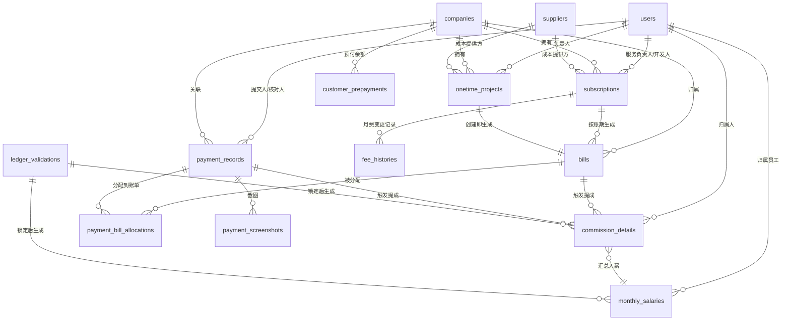
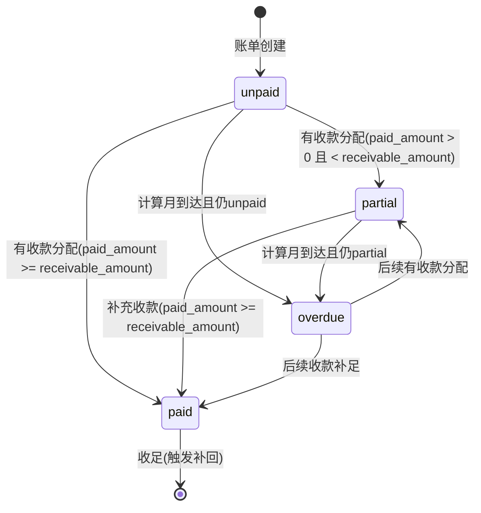
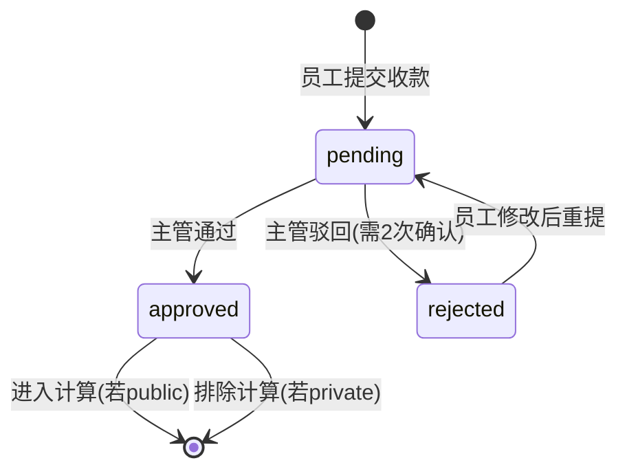

# 薪资管理工具 — 数据库设计文档

> 文档状态：v3（含多对多分配 + 预付款机制）
> 对应设计步骤：第 6 步 — 详细数据库表结构设计
> 数据库：MySQL 8.0 / ORM：SQLAlchemy 2.0 / 迁移：Alembic
> 基础文档：`/workspace/需求规格说明书.md`（SRS v3）、`/workspace/整体设计文档.md`（第 3 步领域实体）

---

## 1. 数据库总览

### 1.1 表清单

| # | 表名 | 中文名 | 所属域 | 说明 |
|---|------|--------|--------|------|
| 1 | users | 用户表 | 身份域 | 系统用户，一人多角色 |
| 2 | companies | 客户表 | 客户域 | 服务对象企业，含介绍人/销售人员/状态 |
| 3 | suppliers | 供应商表 | 客户域 | 成本提供方 |
| 4 | subscriptions | 长期业务表 | 业务域 | 按账期循环计费 |
| 5 | onetime_projects | 一次性业务表 | 业务域 | 单次项目 |
| 6 | fee_histories | 月费变更历史表 | 账单域 | 月费调整记录 |
| 7 | bills | 账单表 | 账单域 | 业务与收款的纽带，含跟进人 |
| 8 | payment_records | 收款记录表 | 收款域 | 员工填报/导入的收款 |
| 9 | payment_bill_allocations | 收款账单分配表 | 收款域 | ⭐ 多对多关联 |
| 10 | payment_screenshots | 收款截图表 | 收款域 | 凭证图片 |
| 11 | customer_prepayments | 客户预付款表 | 收款域 | ⭐ 多交款自动转预付 |
| 12 | commission_details | 提成明细表 | 薪酬域 | 单笔提成，可追溯 |
| 13 | monthly_salaries | 月度薪资表 | 薪酬域 | 员工月度薪资汇总 |
| 14 | ledger_validations | 内账校验锁表 | 薪酬域 | 月度锁定记录 |
| 15 | cost_presets | 成本预设表 | 配置域 | 业务类型→默认成本 |
| 16 | bonus_tiers | 超额阶梯配置表 | 配置域 | P1 仅配置不计算 |
| 17 | subscription_owner_histories | 长期业务负责人变更历史表 | 业务域 | ⭐ v3 新增，补回归属依据 |
| 18 | onetime_owner_histories | 一次性业务负责人变更历史表 | 业务域 | ⭐ v3 新增 |
| 19 | bill_follow_up_histories | 账单跟进人变更历史表 | 账单域 | ⭐ v3 新增 |

### 1.2 完整 ER 关系图



---

## 2. 通用约定

### 2.1 命名规范

| 项 | 规则 | 示例 |
|----|------|------|
| 表名 | 小写蛇形，复数 | `users`, `payment_records` |
| 字段名 | 小写蛇形 | `company_id`, `created_at` |
| 主键 | `id`，BIGINT UNSIGNED AUTO_INCREMENT | — |
| 外键 | `{表名单数}_id` | `company_id`, `user_id` |
| 布尔 | `is_` 前缀，TINYINT(1) | `is_active`, `is_archived` |
| 时间 | `_at` 后缀，DATETIME | `created_at`, `updated_at` |
| 枚举 | VARCHAR(20)，应用层校验 | `pending`, `approved` |
| 金额 | DECIMAL(12,2) | `1000.00` |
| 比例 | DECIMAL(5,4) | `0.1500` |

### 2.2 通用字段

每张表都包含：

| 字段 | 类型 | 说明 |
|------|------|------|
| id | BIGINT UNSIGNED PK AI | 主键 |
| created_at | DATETIME DEFAULT CURRENT_TIMESTAMP | 创建时间 |
| updated_at | DATETIME ON UPDATE CURRENT_TIMESTAMP | 更新时间 |

---

## 3. 详细表结构

### 3.1 users — 用户表

```sql
CREATE TABLE users (
    id              BIGINT UNSIGNED AUTO_INCREMENT PRIMARY KEY,
    username        VARCHAR(50)  NOT NULL COMMENT '登录用户名',
    password_hash   VARCHAR(255) NOT NULL COMMENT 'bcrypt哈希密码',
    name            VARCHAR(50)  NOT NULL COMMENT '真实姓名',
    base_salary     DECIMAL(12,2) NOT NULL DEFAULT 0 COMMENT '固定底薪',
    permissions     JSON          NOT NULL COMMENT '权限点列表, 如 ["payment:submit","salary:view"]',
    data_scope      VARCHAR(10)  NOT NULL DEFAULT 'SELF' COMMENT '数据范围: SELF / ALL',
    is_active       TINYINT(1)   NOT NULL DEFAULT 1 COMMENT '是否在职: 1=在职, 0=离职',
    is_admin        TINYINT(1)   NOT NULL DEFAULT 0 COMMENT '是否超管',
    created_at      DATETIME     NOT NULL DEFAULT CURRENT_TIMESTAMP,
    updated_at      DATETIME     NOT NULL DEFAULT CURRENT_TIMESTAMP ON UPDATE CURRENT_TIMESTAMP,

    UNIQUE KEY uk_username (username),
    KEY idx_is_active (is_active)
) ENGINE=InnoDB DEFAULT CHARSET=utf8mb4 COMMENT='用户表';
```

**索引说明：**
- `uk_username`：用户名唯一索引
- `idx_is_active`：按在职状态查询

### 3.2 companies — 客户表

```sql
CREATE TABLE companies (
    id                  BIGINT UNSIGNED AUTO_INCREMENT PRIMARY KEY,
    name                VARCHAR(100) NOT NULL COMMENT '客户名称',
    region_tags         JSON         NOT NULL COMMENT '区域标签(扁平), 如 ["广州","佛山"]',
    is_new_customer     TINYINT(1)   NOT NULL DEFAULT 0 COMMENT '是否新客',
    service_start_date  DATE         NULL     COMMENT '服务开始日期(销售提成12月计时起点)',
    status              VARCHAR(20)  NOT NULL DEFAULT 'active' COMMENT '客户状态: potential/active/lost',
    introducer_type     VARCHAR(10)  NOT NULL DEFAULT 'external' COMMENT '介绍人类型: internal(内部员工)/external(外部)',
    introducer_user_id  BIGINT UNSIGNED NULL COMMENT '介绍人(内部员工时关联users)',
    introducer_name     VARCHAR(50)  NULL     COMMENT '介绍人姓名(外部时填)',
    sales_person_id     BIGINT UNSIGNED NULL COMMENT '销售人员(关联users)',
    contact_phone       VARCHAR(50)  NULL     COMMENT '联系电话',
    contact_email       VARCHAR(100) NULL     COMMENT '联系邮箱',
    remark              TEXT         NULL     COMMENT '备注',
    is_archived         TINYINT(1)   NOT NULL DEFAULT 0 COMMENT '软删除标记',
    created_at          DATETIME     NOT NULL DEFAULT CURRENT_TIMESTAMP,
    updated_at          DATETIME     NOT NULL DEFAULT CURRENT_TIMESTAMP ON UPDATE CURRENT_TIMESTAMP,

    KEY idx_name (name),
    KEY idx_is_archived (is_archived),
    KEY idx_status (status),
    KEY idx_sales_person (sales_person_id),
    KEY idx_introducer_user (introducer_user_id),
    CONSTRAINT fk_comp_sales_person FOREIGN KEY (sales_person_id) REFERENCES users(id),
    CONSTRAINT fk_comp_introducer FOREIGN KEY (introducer_user_id) REFERENCES users(id)
) ENGINE=InnoDB DEFAULT CHARSET=utf8mb4 COMMENT='客户表';
```

### 3.3 suppliers — 供应商表

```sql
CREATE TABLE suppliers (
    id          BIGINT UNSIGNED AUTO_INCREMENT PRIMARY KEY,
    name        VARCHAR(100) NOT NULL COMMENT '供应商名称',
    type        VARCHAR(20)  NOT NULL COMMENT '类型: 刻章/地址挂靠/审计/其他',
    contact     VARCHAR(200) NULL     COMMENT '联系方式',
    remark      TEXT         NULL     COMMENT '备注',
    is_archived TINYINT(1)   NOT NULL DEFAULT 0 COMMENT '软删除标记',
    created_at  DATETIME     NOT NULL DEFAULT CURRENT_TIMESTAMP,
    updated_at  DATETIME     NOT NULL DEFAULT CURRENT_TIMESTAMP ON UPDATE CURRENT_TIMESTAMP,

    KEY idx_name (name),
    KEY idx_type (type)
) ENGINE=InnoDB DEFAULT CHARSET=utf8mb4 COMMENT='供应商表';
```

### 3.4 subscriptions — 长期业务表

```sql
CREATE TABLE subscriptions (
    id                BIGINT UNSIGNED AUTO_INCREMENT PRIMARY KEY,
    company_id        BIGINT UNSIGNED NOT NULL COMMENT '关联客户',
    service_type      VARCHAR(50)  NOT NULL COMMENT '服务类型, 如 代理记账',
    billing_period    VARCHAR(10) NOT NULL COMMENT '账期: month/quarter/half_year/year',
    monthly_fee       DECIMAL(12,2) NOT NULL COMMENT '当前月费(历史变更见fee_histories)',
    is_cost_type      TINYINT(1)  NOT NULL DEFAULT 0 COMMENT '是否成本类业务',
    monthly_cost      DECIMAL(12,2) NOT NULL DEFAULT 0 COMMENT '月成本',
    supplier_id       BIGINT UNSIGNED NULL COMMENT '关联供应商',
    service_owner_id  BIGINT UNSIGNED NOT NULL COMMENT '服务负责人(→服务提成)',
    sales_owner_id    BIGINT UNSIGNED NULL COMMENT '开发人(→销售提成)',
    start_date        DATE         NOT NULL COMMENT '业务开始日期',
    is_active         TINYINT(1)   NOT NULL DEFAULT 1 COMMENT '启停状态',
    is_archived       TINYINT(1)   NOT NULL DEFAULT 0 COMMENT '软删除标记',
    created_at        DATETIME     NOT NULL DEFAULT CURRENT_TIMESTAMP,
    updated_at        DATETIME     NOT NULL DEFAULT CURRENT_TIMESTAMP ON UPDATE CURRENT_TIMESTAMP,

    KEY idx_company_id (company_id),
    KEY idx_supplier_id (supplier_id),
    KEY idx_service_owner (service_owner_id),
    KEY idx_sales_owner (sales_owner_id),
    KEY idx_is_active (is_active),
    CONSTRAINT fk_sub_company FOREIGN KEY (company_id) REFERENCES companies(id),
    CONSTRAINT fk_sub_supplier FOREIGN KEY (supplier_id) REFERENCES suppliers(id),
    CONSTRAINT fk_sub_service_owner FOREIGN KEY (service_owner_id) REFERENCES users(id),
    CONSTRAINT fk_sub_sales_owner FOREIGN KEY (sales_owner_id) REFERENCES users(id)
) ENGINE=InnoDB DEFAULT CHARSET=utf8mb4 COMMENT='长期业务表';
```

### 3.5 onetime_projects — 一次性业务表

```sql
CREATE TABLE onetime_projects (
    id                BIGINT UNSIGNED AUTO_INCREMENT PRIMARY KEY,
    company_id        BIGINT UNSIGNED NOT NULL COMMENT '关联客户',
    project_type      VARCHAR(50)  NOT NULL COMMENT '项目类型',
    revenue           DECIMAL(12,2) NOT NULL COMMENT '收入',
    cost              DECIMAL(12,2) NOT NULL DEFAULT 0 COMMENT '成本',
    gross_profit      DECIMAL(12,2) GENERATED ALWAYS AS (revenue - cost) STORED COMMENT '毛利(计算列)',
    supplier_id       BIGINT UNSIGNED NULL COMMENT '关联供应商',
    owner_id          BIGINT UNSIGNED NOT NULL COMMENT '负责人(→一次性提成)',
    completion_date   DATE         NULL COMMENT '完成日期',
    is_received       TINYINT(1)   NOT NULL DEFAULT 0 COMMENT '是否已收款',
    receive_date      DATE         NULL COMMENT '收款日期',
    is_archived       TINYINT(1)   NOT NULL DEFAULT 0 COMMENT '软删除标记',
    created_at        DATETIME     NOT NULL DEFAULT CURRENT_TIMESTAMP,
    updated_at        DATETIME     NOT NULL DEFAULT CURRENT_TIMESTAMP ON UPDATE CURRENT_TIMESTAMP,

    KEY idx_company_id (company_id),
    KEY idx_owner_id (owner_id),
    KEY idx_completion_date (completion_date),
    CONSTRAINT fk_ot_company FOREIGN KEY (company_id) REFERENCES companies(id),
    CONSTRAINT fk_ot_supplier FOREIGN KEY (supplier_id) REFERENCES suppliers(id),
    CONSTRAINT fk_ot_owner FOREIGN KEY (owner_id) REFERENCES users(id)
) ENGINE=InnoDB DEFAULT CHARSET=utf8mb4 COMMENT='一次性业务表';
```

> **注**：`gross_profit` 使用 MySQL 8.0 生成列（GENERATED ALWAYS AS），自动计算。

### 3.6 fee_histories — 月费变更历史表

```sql
CREATE TABLE fee_histories (
    id                BIGINT UNSIGNED AUTO_INCREMENT PRIMARY KEY,
    subscription_id   BIGINT UNSIGNED NOT NULL COMMENT '关联长期业务',
    old_fee           DECIMAL(12,2) NOT NULL COMMENT '旧月费',
    new_fee           DECIMAL(12,2) NOT NULL COMMENT '新月费',
    effective_date    DATE         NOT NULL COMMENT '生效日期(该日起按new_fee计算)',
    changed_by        BIGINT UNSIGNED NOT NULL COMMENT '操作人',
    created_at        DATETIME     NOT NULL DEFAULT CURRENT_TIMESTAMP,

    KEY idx_subscription_id (subscription_id),
    KEY idx_effective_date (effective_date),
    CONSTRAINT fk_fh_subscription FOREIGN KEY (subscription_id) REFERENCES subscriptions(id),
    CONSTRAINT fk_fh_changed_by FOREIGN KEY (changed_by) REFERENCES users(id)
) ENGINE=InnoDB DEFAULT CHARSET=utf8mb4 COMMENT='月费变更历史表';
```

### 3.7 bills — 账单表 ⭐

```sql
CREATE TABLE bills (
    id                  BIGINT UNSIGNED AUTO_INCREMENT PRIMARY KEY,
    company_id          BIGINT UNSIGNED NOT NULL COMMENT '关联客户',
    subscription_id     BIGINT UNSIGNED NULL COMMENT '关联长期业务(与onetime_project_id互斥)',
    onetime_project_id  BIGINT UNSIGNED NULL COMMENT '关联一次性业务(与subscription_id互斥)',
    bill_type           VARCHAR(10) NOT NULL COMMENT '类型: subscription / onetime',
    billing_year        INT         NOT NULL COMMENT '账单年份',
    billing_month       INT         NOT NULL COMMENT '账单月份(1-12)',
    receivable_amount   DECIMAL(12,2) NOT NULL COMMENT '应收金额',
    paid_amount         DECIMAL(12,2) NOT NULL DEFAULT 0 COMMENT '已收金额(累计已核对+公用)',
    payment_status      VARCHAR(10) NOT NULL DEFAULT 'unpaid' COMMENT '状态: unpaid/partial/paid/overdue',
    is_overdue          TINYINT(1)  NOT NULL DEFAULT 0 COMMENT '是否欠费',
    follow_up_user_id   BIGINT UNSIGNED NULL COMMENT '跟进人(关联users)',
    created_at          DATETIME    NOT NULL DEFAULT CURRENT_TIMESTAMP,
    updated_at          DATETIME    NOT NULL DEFAULT CURRENT_TIMESTAMP ON UPDATE CURRENT_TIMESTAMP,

    UNIQUE KEY uk_sub_month (subscription_id, billing_year, billing_month),
    UNIQUE KEY uk_ot_month (onetime_project_id, billing_year, billing_month),
    KEY idx_company_id (company_id),
    KEY idx_billing_period (billing_year, billing_month),
    KEY idx_payment_status (payment_status),
    KEY idx_follow_up (follow_up_user_id),
    CONSTRAINT fk_bill_company FOREIGN KEY (company_id) REFERENCES companies(id),
    CONSTRAINT fk_bill_subscription FOREIGN KEY (subscription_id) REFERENCES subscriptions(id),
    CONSTRAINT fk_bill_onetime FOREIGN KEY (onetime_project_id) REFERENCES onetime_projects(id),
    CONSTRAINT fk_bill_follow_up FOREIGN KEY (follow_up_user_id) REFERENCES users(id),
    CONSTRAINT chk_bill_type CHECK (
        (bill_type = 'subscription' AND subscription_id IS NOT NULL AND onetime_project_id IS NULL)
        OR
        (bill_type = 'onetime' AND onetime_project_id IS NOT NULL AND subscription_id IS NULL)
    )
) ENGINE=InnoDB DEFAULT CHARSET=utf8mb4 COMMENT='账单表';
```

**关键约束：**
- `uk_sub_month`：(subscription_id, billing_year, billing_month) 唯一索引 — 防止重复生成
- `uk_ot_month`：(onetime_project_id, billing_year, billing_month) 唯一索引
- `chk_bill_type`：CHECK 约束 — subscription_id 和 onetime_project_id 互斥

### 3.8 payment_records — 收款记录表

```sql
CREATE TABLE payment_records (
    id                    BIGINT UNSIGNED AUTO_INCREMENT PRIMARY KEY,
    company_id            BIGINT UNSIGNED NOT NULL COMMENT '关联客户',
    amount                DECIMAL(12,2) NOT NULL COMMENT '收款总金额',
    payment_date          DATE         NOT NULL COMMENT '收款日期',
    channel               VARCHAR(20) NOT NULL COMMENT '渠道: bank/wechat/alipay/corporate/cash',
    submitter_id          BIGINT UNSIGNED NOT NULL COMMENT '提交人',
    assigned_verifier_id  BIGINT UNSIGNED NOT NULL COMMENT '核对人',
    verify_status         VARCHAR(10) NOT NULL DEFAULT 'pending' COMMENT '核对状态: pending/approved/rejected',
    reject_reason         VARCHAR(500) NULL COMMENT '驳回原因(选填, 需2次确认)',
    usage_type            VARCHAR(10) NOT NULL DEFAULT 'public' COMMENT '公私: public/private',
    remark                TEXT         NULL COMMENT '备注',
    created_at            DATETIME     NOT NULL DEFAULT CURRENT_TIMESTAMP,
    updated_at            DATETIME     NOT NULL DEFAULT CURRENT_TIMESTAMP ON UPDATE CURRENT_TIMESTAMP,

    KEY idx_company_id (company_id),
    KEY idx_payment_date (payment_date),
    KEY idx_submitter (submitter_id),
    KEY idx_verifier (assigned_verifier_id),
    KEY idx_verify_status (verify_status),
    KEY idx_usage_type (usage_type),
    CONSTRAINT fk_pay_company FOREIGN KEY (company_id) REFERENCES companies(id),
    CONSTRAINT fk_pay_submitter FOREIGN KEY (submitter_id) REFERENCES users(id),
    CONSTRAINT fk_pay_verifier FOREIGN KEY (assigned_verifier_id) REFERENCES users(id),
    CONSTRAINT chk_amount CHECK (amount > 0)
) ENGINE=InnoDB DEFAULT CHARSET=utf8mb4 COMMENT='收款记录表';
```

> **v3 变更**：去掉了 bill_id 直接外键。收款与账单通过 payment_bill_allocations 关联表实现多对多。

### 3.9 payment_bill_allocations — 收款账单分配表 ⭐ v3 新增

```sql
CREATE TABLE payment_bill_allocations (
    id                  BIGINT UNSIGNED AUTO_INCREMENT PRIMARY KEY,
    payment_record_id   BIGINT UNSIGNED NOT NULL COMMENT '关联收款记录',
    bill_id             BIGINT UNSIGNED NOT NULL COMMENT '关联账单',
    allocation_amount   DECIMAL(12,2) NOT NULL COMMENT '分配到该账单的金额',
    source              VARCHAR(20) NOT NULL DEFAULT 'payment' COMMENT '来源: payment(收款分配) / prepayment(预付抵扣)',
    created_at          DATETIME     NOT NULL DEFAULT CURRENT_TIMESTAMP,

    KEY idx_payment_record_id (payment_record_id),
    KEY idx_bill_id (bill_id),
    CONSTRAINT fk_pba_payment FOREIGN KEY (payment_record_id) REFERENCES payment_records(id) ON DELETE CASCADE,
    CONSTRAINT fk_pba_bill FOREIGN KEY (bill_id) REFERENCES bills(id),
    CONSTRAINT chk_allocation CHECK (allocation_amount > 0)
) ENGINE=InnoDB DEFAULT CHARSET=utf8mb4 COMMENT='收款账单分配表(多对多)';
```

> **多对多关系核心表**：一笔 payment_record 可对应多条 allocation（一笔收款拆到多个账单）；一条 bill 也可对应多条 allocation（多笔收款凑齐一张账单）。

### 3.10 payment_screenshots — 收款截图表

```sql
CREATE TABLE payment_screenshots (
    id                BIGINT UNSIGNED AUTO_INCREMENT PRIMARY KEY,
    payment_record_id BIGINT UNSIGNED NOT NULL COMMENT '关联收款记录',
    file_path         VARCHAR(500) NOT NULL COMMENT '文件存储路径',
    file_name         VARCHAR(255) NOT NULL COMMENT '原始文件名',
    file_size         INT          NOT NULL COMMENT '文件大小(字节)',
    created_at        DATETIME     NOT NULL DEFAULT CURRENT_TIMESTAMP,

    KEY idx_payment_record_id (payment_record_id),
    CONSTRAINT fk_ps_payment FOREIGN KEY (payment_record_id) REFERENCES payment_records(id) ON DELETE CASCADE
) ENGINE=InnoDB DEFAULT CHARSET=utf8mb4 COMMENT='收款截图表';
```

### 3.11 customer_prepayments — 客户预付款表 ⭐ v3 新增

```sql
CREATE TABLE customer_prepayments (
    id          BIGINT UNSIGNED AUTO_INCREMENT PRIMARY KEY,
    company_id  BIGINT UNSIGNED NOT NULL COMMENT '关联客户',
    balance     DECIMAL(12,2) NOT NULL DEFAULT 0 COMMENT '当前预付余额',
    source      VARCHAR(20) NOT NULL DEFAULT 'overpayment' COMMENT '来源: overpayment(多交转入) / manual(手动充值)',
    remark      TEXT         NULL COMMENT '备注',
    created_at  DATETIME     NOT NULL DEFAULT CURRENT_TIMESTAMP,
    updated_at  DATETIME     NOT NULL DEFAULT CURRENT_TIMESTAMP ON UPDATE CURRENT_TIMESTAMP,

    KEY idx_company_id (company_id),
    CONSTRAINT fk_cp_company FOREIGN KEY (company_id) REFERENCES companies(id)
) ENGINE=InnoDB DEFAULT CHARSET=utf8mb4 COMMENT='客户预付款表';
```

### 3.12 commission_details — 提成明细表

```sql
CREATE TABLE commission_details (
    id                    BIGINT UNSIGNED AUTO_INCREMENT PRIMARY KEY,
    user_id               BIGINT UNSIGNED NOT NULL COMMENT '归属员工',
    commission_type      VARCHAR(10) NOT NULL COMMENT '类型: service/sales/onetime',
    bill_id              BIGINT UNSIGNED NULL COMMENT '来源账单',
    payment_record_id    BIGINT UNSIGNED NULL COMMENT '来源收款(服务提成可空)',
    company_id           BIGINT UNSIGNED NOT NULL COMMENT '来源客户',
    subscription_id      BIGINT UNSIGNED NULL COMMENT '来源长期业务',
    onetime_project_id   BIGINT UNSIGNED NULL COMMENT '来源一次性业务',
    billing_year         INT          NOT NULL COMMENT '计提年',
    billing_month        INT          NOT NULL COMMENT '计提月',
    base_amount          DECIMAL(12,2) NOT NULL COMMENT '计算基数(月费/收款金额/毛利)',
    rate                 DECIMAL(5,4) NOT NULL COMMENT '比例(0.15/0.20)',
    commission_amount    DECIMAL(12,2) NOT NULL COMMENT '提成金额(=base×rate)',
    deduction_amount     DECIMAL(12,2) NOT NULL DEFAULT 0 COMMENT '欠费扣款(正数)',
    supplement_amount    DECIMAL(12,2) NOT NULL DEFAULT 0 COMMENT '补回金额(正数)',
    net_amount           DECIMAL(12,2) NOT NULL COMMENT '净额(=commission-deduction+supplement)',
    is_supplement        TINYINT(1)   NOT NULL DEFAULT 0 COMMENT '是否为补回记录',
    supplement_for_user_id BIGINT UNSIGNED NULL COMMENT '补回归属的原被扣人(v3)',
    ledger_validation_id BIGINT UNSIGNED NULL COMMENT '关联校验锁',
    created_at           DATETIME     NOT NULL DEFAULT CURRENT_TIMESTAMP,

    KEY idx_user_month (user_id, billing_year, billing_month),
    KEY idx_bill_id (bill_id),
    KEY idx_company_id (company_id),
    KEY idx_billing_period (billing_year, billing_month),
    KEY idx_ledger (ledger_validation_id),
    CONSTRAINT fk_cd_user FOREIGN KEY (user_id) REFERENCES users(id),
    CONSTRAINT fk_cd_bill FOREIGN KEY (bill_id) REFERENCES bills(id),
    CONSTRAINT fk_cd_payment FOREIGN KEY (payment_record_id) REFERENCES payment_records(id),
    CONSTRAINT fk_cd_company FOREIGN KEY (company_id) REFERENCES companies(id),
    CONSTRAINT fk_cd_subscription FOREIGN KEY (subscription_id) REFERENCES subscriptions(id),
    CONSTRAINT fk_cd_onetime FOREIGN KEY (onetime_project_id) REFERENCES onetime_projects(id),
    CONSTRAINT fk_cd_ledger FOREIGN KEY (ledger_validation_id) REFERENCES ledger_validations(id),
    CONSTRAINT fk_cd_supplement_for FOREIGN KEY (supplement_for_user_id) REFERENCES users(id)
) ENGINE=InnoDB DEFAULT CHARSET=utf8mb4 COMMENT='提成明细表';
```

> **v3 变更**：新增 `supplement_for_user_id` 字段 — 补回记录归属原被扣人（即使当前业务负责人已变更）。

### 3.13 monthly_salaries — 月度薪资表

```sql
CREATE TABLE monthly_salaries (
    id                    BIGINT UNSIGNED AUTO_INCREMENT PRIMARY KEY,
    user_id               BIGINT UNSIGNED NOT NULL COMMENT '归属员工',
    salary_year           INT            NOT NULL COMMENT '薪资年',
    salary_month          INT            NOT NULL COMMENT '薪资月',
    base_salary           DECIMAL(12,2) NOT NULL COMMENT '底薪(从users带出)',
    service_commission    DECIMAL(12,2) NOT NULL DEFAULT 0 COMMENT '服务提成合计',
    sales_commission      DECIMAL(12,2) NOT NULL DEFAULT 0 COMMENT '销售提成合计',
    onetime_commission    DECIMAL(12,2) NOT NULL DEFAULT 0 COMMENT '一次性提成合计',
    total_deduction       DECIMAL(12,2) NOT NULL DEFAULT 0 COMMENT '欠费扣款合计',
    total_supplement      DECIMAL(12,2) NOT NULL DEFAULT 0 COMMENT '补回合计',
    bonus_amount          DECIMAL(12,2) NOT NULL DEFAULT 0 COMMENT '超额奖励(P2, P1=0)',
    gross_payable         DECIMAL(12,2) NOT NULL COMMENT '应发合计',
    year_end_bonus        DECIMAL(12,2) NOT NULL DEFAULT 0 COMMENT '年终奖(P1预留=0)',
    tax_amount            DECIMAL(12,2) NOT NULL DEFAULT 0 COMMENT '个税(P1预留=0)',
    social_insurance      DECIMAL(12,2) NOT NULL DEFAULT 0 COMMENT '社保(P1预留=0)',
    housing_fund          DECIMAL(12,2) NOT NULL DEFAULT 0 COMMENT '公积金(P1预留=0)',
    ledger_validation_id  BIGINT UNSIGNED NOT NULL COMMENT '关联校验锁',
    created_at            DATETIME       NOT NULL DEFAULT CURRENT_TIMESTAMP,

    UNIQUE KEY uk_user_month (user_id, salary_year, salary_month),
    KEY idx_period (salary_year, salary_month),
    KEY idx_ledger (ledger_validation_id),
    CONSTRAINT fk_ms_user FOREIGN KEY (user_id) REFERENCES users(id),
    CONSTRAINT fk_ms_ledger FOREIGN KEY (ledger_validation_id) REFERENCES ledger_validations(id)
) ENGINE=InnoDB DEFAULT CHARSET=utf8mb4 COMMENT='月度薪资表';
```

> **应发公式**：`gross_payable = base_salary + service_commission + sales_commission + onetime_commission + total_supplement - total_deduction`

### 3.14 ledger_validations — 内账校验锁表

```sql
CREATE TABLE ledger_validations (
    id                  BIGINT UNSIGNED AUTO_INCREMENT PRIMARY KEY,
    ledger_year         INT          NOT NULL COMMENT '锁定年',
    ledger_month        INT          NOT NULL COMMENT '锁定月',
    status              VARCHAR(15) NOT NULL DEFAULT 'unlocked' COMMENT '状态: unlocked/locked/calculating',
    locked_by           BIGINT UNSIGNED NULL COMMENT '锁定操作人',
    locked_at           DATETIME     NULL COMMENT '锁定时间',
    unlocked_by         BIGINT UNSIGNED NULL COMMENT '撤销操作人',
    unlocked_at         DATETIME     NULL COMMENT '撤销时间',
    calculation_status  VARCHAR(15) NOT NULL DEFAULT 'idle' COMMENT '计算状态: idle/running/completed/failed',
    created_at          DATETIME     NOT NULL DEFAULT CURRENT_TIMESTAMP,
    updated_at          DATETIME     NOT NULL DEFAULT CURRENT_TIMESTAMP ON UPDATE CURRENT_TIMESTAMP,

    UNIQUE KEY uk_year_month (ledger_year, ledger_month),
    KEY idx_status (status),
    CONSTRAINT fk_lv_locked_by FOREIGN KEY (locked_by) REFERENCES users(id),
    CONSTRAINT fk_lv_unlocked_by FOREIGN KEY (unlocked_by) REFERENCES users(id)
) ENGINE=InnoDB DEFAULT CHARSET=utf8mb4 COMMENT='内账校验锁表';
```

### 3.15 cost_presets — 成本预设表

```sql
CREATE TABLE cost_presets (
    id            BIGINT UNSIGNED AUTO_INCREMENT PRIMARY KEY,
    business_type VARCHAR(50)   NOT NULL COMMENT '业务类型',
    default_cost  DECIMAL(12,2) NOT NULL COMMENT '默认成本',
    is_active     TINYINT(1)   NOT NULL DEFAULT 1 COMMENT '启用状态',
    created_at    DATETIME     NOT NULL DEFAULT CURRENT_TIMESTAMP,
    updated_at    DATETIME     NOT NULL DEFAULT CURRENT_TIMESTAMP ON UPDATE CURRENT_TIMESTAMP,

    UNIQUE KEY uk_business_type (business_type)
) ENGINE=InnoDB DEFAULT CHARSET=utf8mb4 COMMENT='成本预设表';
```

### 3.16 bonus_tiers — 超额阶梯配置表

```sql
CREATE TABLE bonus_tiers (
    id          BIGINT UNSIGNED AUTO_INCREMENT PRIMARY KEY,
    tier_name   VARCHAR(50)   NOT NULL COMMENT '阶梯名称',
    min_amount  DECIMAL(12,2) NOT NULL COMMENT '提成总额下限(含)',
    max_amount  DECIMAL(12,2) NULL COMMENT '提成总额上限(不含, NULL=无上限)',
    bonus_rate  DECIMAL(5,4)  NOT NULL COMMENT '奖励比例',
    is_active   TINYINT(1)   NOT NULL DEFAULT 1 COMMENT '启用状态',
    sort_order  INT          NOT NULL DEFAULT 0 COMMENT '排序(从小到大)',
    created_at  DATETIME     NOT NULL DEFAULT CURRENT_TIMESTAMP,
    updated_at  DATETIME     NOT NULL DEFAULT CURRENT_TIMESTAMP ON UPDATE CURRENT_TIMESTAMP,

    KEY idx_sort_order (sort_order),
    KEY idx_is_active (is_active)
) ENGINE=InnoDB DEFAULT CHARSET=utf8mb4 COMMENT='超额阶梯配置表(P1仅配置)';
```

### 3.17 subscription_owner_histories — 长期业务负责人变更历史表 ⭐ v3 新增

```sql
CREATE TABLE subscription_owner_histories (
    id                  BIGINT UNSIGNED AUTO_INCREMENT PRIMARY KEY,
    subscription_id     BIGINT UNSIGNED NOT NULL COMMENT '关联长期业务',
    change_type         VARCHAR(20) NOT NULL COMMENT '变更类型: service_owner / sales_owner',
    old_user_id         BIGINT UNSIGNED NULL COMMENT '原负责人',
    new_user_id         BIGINT UNSIGNED NULL COMMENT '新负责人',
    effective_date      DATE         NOT NULL COMMENT '生效日期',
    changed_by          BIGINT UNSIGNED NOT NULL COMMENT '操作人',
    remark              VARCHAR(500) NULL COMMENT '变更原因',
    created_at          DATETIME     NOT NULL DEFAULT CURRENT_TIMESTAMP,

    KEY idx_subscription_id (subscription_id),
    KEY idx_change_type (change_type),
    KEY idx_effective_date (effective_date),
    CONSTRAINT fk_soh_subscription FOREIGN KEY (subscription_id) REFERENCES subscriptions(id),
    CONSTRAINT fk_soh_old_user FOREIGN KEY (old_user_id) REFERENCES users(id),
    CONSTRAINT fk_soh_new_user FOREIGN KEY (new_user_id) REFERENCES users(id),
    CONSTRAINT fk_soh_changed_by FOREIGN KEY (changed_by) REFERENCES users(id)
) ENGINE=InnoDB DEFAULT CHARSET=utf8mb4 COMMENT='长期业务负责人变更历史表';
```

> **补回关联**：当补回触发时，通过此表查找欠费扣款期间的实际负责人（即 `old_user_id`），补回款归该人。

### 3.18 onetime_owner_histories — 一次性业务负责人变更历史表 ⭐ v3 新增

```sql
CREATE TABLE onetime_owner_histories (
    id                  BIGINT UNSIGNED AUTO_INCREMENT PRIMARY KEY,
    onetime_project_id  BIGINT UNSIGNED NOT NULL COMMENT '关联一次性业务',
    old_user_id         BIGINT UNSIGNED NULL COMMENT '原负责人',
    new_user_id         BIGINT UNSIGNED NULL COMMENT '新负责人',
    effective_date      DATE         NOT NULL COMMENT '生效日期',
    changed_by          BIGINT UNSIGNED NOT NULL COMMENT '操作人',
    remark              VARCHAR(500) NULL COMMENT '变更原因',
    created_at          DATETIME     NOT NULL DEFAULT CURRENT_TIMESTAMP,

    KEY idx_onetime_project_id (onetime_project_id),
    KEY idx_effective_date (effective_date),
    CONSTRAINT fk_ooh_onetime FOREIGN KEY (onetime_project_id) REFERENCES onetime_projects(id),
    CONSTRAINT fk_ooh_old_user FOREIGN KEY (old_user_id) REFERENCES users(id),
    CONSTRAINT fk_ooh_new_user FOREIGN KEY (new_user_id) REFERENCES users(id),
    CONSTRAINT fk_ooh_changed_by FOREIGN KEY (changed_by) REFERENCES users(id)
) ENGINE=InnoDB DEFAULT CHARSET=utf8mb4 COMMENT='一次性业务负责人变更历史表';
```

### 3.19 bill_follow_up_histories — 账单跟进人变更历史表 ⭐ v3 新增

```sql
CREATE TABLE bill_follow_up_histories (
    id              BIGINT UNSIGNED AUTO_INCREMENT PRIMARY KEY,
    bill_id         BIGINT UNSIGNED NOT NULL COMMENT '关联账单',
    old_user_id     BIGINT UNSIGNED NULL COMMENT '原跟进人',
    new_user_id     BIGINT UNSIGNED NULL COMMENT '新跟进人',
    effective_date  DATE         NOT NULL COMMENT '生效日期',
    changed_by      BIGINT UNSIGNED NOT NULL COMMENT '操作人',
    remark          VARCHAR(500) NULL COMMENT '变更原因',
    created_at      DATETIME     NOT NULL DEFAULT CURRENT_TIMESTAMP,

    KEY idx_bill_id (bill_id),
    KEY idx_effective_date (effective_date),
    CONSTRAINT fk_bfh_bill FOREIGN KEY (bill_id) REFERENCES bills(id),
    CONSTRAINT fk_bfh_old_user FOREIGN KEY (old_user_id) REFERENCES users(id),
    CONSTRAINT fk_bfh_new_user FOREIGN KEY (new_user_id) REFERENCES users(id),
    CONSTRAINT fk_bfh_changed_by FOREIGN KEY (changed_by) REFERENCES users(id)
) ENGINE=InnoDB DEFAULT CHARSET=utf8mb4 COMMENT='账单跟进人变更历史表';
```

---

## 4. 索引汇总

| 表 | 索引名 | 字段 | 类型 | 用途 |
|----|--------|------|------|------|
| users | uk_username | username | UNIQUE | 登录查询 |
| users | idx_is_active | is_active | INDEX | 在职筛选 |
| companies | idx_name | name | INDEX | 名称搜索 |
| subscriptions | idx_company_id | company_id | INDEX | 按客户查业务 |
| subscriptions | idx_service_owner | service_owner_id | INDEX | 按负责人查 |
| bills | uk_sub_month | subscription_id, billing_year, billing_month | UNIQUE | 幂等防重 |
| bills | uk_ot_month | onetime_project_id, billing_year, billing_month | UNIQUE | 幂等防重 |
| bills | idx_billing_period | billing_year, billing_month | INDEX | 按月查账单 |
| bills | idx_payment_status | payment_status | INDEX | 按状态筛选 |
| payment_records | idx_verify_status | verify_status | INDEX | 核对列表 |
| payment_records | idx_verifier | assigned_verifier_id | INDEX | 核对人列表 |
| payment_records | idx_payment_date | payment_date | INDEX | 按日期查询 |
| payment_bill_allocations | idx_bill_id | bill_id | INDEX | 账单的收款列表 |
| commission_details | idx_user_month | user_id, billing_year, billing_month | INDEX | 薪资查询 |
| commission_details | idx_billing_period | billing_year, billing_month | INDEX | 月度提成 |
| monthly_salaries | uk_user_month | user_id, salary_year, salary_month | UNIQUE | 防重 |
| ledger_validations | uk_year_month | ledger_year, ledger_month | UNIQUE | 防重 |

---

## 5. 约束汇总

### 5.1 外键约束

| 子表 | 字段 | 父表 | 删除策略 |
|------|------|------|---------|
| subscriptions | company_id | companies | RESTRICT |
| subscriptions | supplier_id | suppliers | SET NULL |
| subscriptions | service_owner_id | users | RESTRICT |
| onetime_projects | company_id | companies | RESTRICT |
| onetime_projects | owner_id | users | RESTRICT |
| fee_histories | subscription_id | subscriptions | CASCADE |
| bills | company_id | companies | RESTRICT |
| bills | subscription_id | subscriptions | SET NULL |
| bills | onetime_project_id | onetime_projects | SET NULL |
| payment_records | company_id | companies | RESTRICT |
| payment_records | submitter_id | users | RESTRICT |
| payment_bill_allocations | payment_record_id | payment_records | CASCADE |
| payment_bill_allocations | bill_id | bills | RESTRICT |
| payment_screenshots | payment_record_id | payment_records | CASCADE |
| customer_prepayments | company_id | companies | RESTRICT |
| commission_details | user_id | users | RESTRICT |
| commission_details | bill_id | bills | SET NULL |
| commission_details | ledger_validation_id | ledger_validations | SET NULL |
| monthly_salaries | user_id | users | RESTRICT |
| monthly_salaries | ledger_validation_id | ledger_validations | RESTRICT |

### 5.2 CHECK 约束

| 表 | 约束名 | 规则 |
|----|--------|------|
| bills | chk_bill_type | subscription_id 和 onetime_project_id 互斥 |
| payment_records | chk_amount | amount > 0 |
| payment_bill_allocations | chk_allocation | allocation_amount > 0 |

### 5.3 唯一约束

| 表 | 约束 | 规则 |
|----|------|------|
| users | uk_username | username 唯一 |
| bills | uk_sub_month | (subscription_id, billing_year, billing_month) 唯一 |
| bills | uk_ot_month | (onetime_project_id, billing_year, billing_month) 唯一 |
| monthly_salaries | uk_user_month | (user_id, salary_year, salary_month) 唯一 |
| ledger_validations | uk_year_month | (ledger_year, ledger_month) 唯一 |
| cost_presets | uk_business_type | business_type 唯一 |

---

## 6. 账单状态转换规则



**状态说明：**
- `unpaid`：未收到任何已核对+公用收款
- `partial`：收到部分款项（paid_amount < receivable_amount）
- `paid`：收足（paid_amount ≥ receivable_amount）→ 触发补回
- `overdue`：计算月到达且未收足 → 触发欠费扣款

---

## 7. 收款核对状态机



---

## 8. 数据库迁移策略

使用 **Alembic** 管理 DDL 变更：

```
alembic/
├── versions/
│   ├── 001_initial_create.py    # 初始建表（19张表）
│   ├── 002_seed_admin.py        # 初始化超管账号
│   └── ...
├── env.py
└── alembic.ini
```

**迁移命令：**
```bash
# 生成迁移脚本
alembic revision --autogenerate -m "description"

# 执行迁移
alembic upgrade head

# 回滚
alembic downgrade -1
```

---

## 9. 初始化数据

系统首次部署时需要插入的种子数据：

```sql
-- 超管账号（密码需部署时修改）
INSERT INTO users (username, password_hash, name, base_salary, permissions, data_scope, is_active, is_admin)
VALUES ('admin', '<bcrypt_hash>', '系统管理员', 0, '["admin:config","payment:submit","payment:verify","salary:view","salary:manage","report:view"]', 'ALL', 1, 1);
```

---

## 10. 风险点

| 风险 | 影响 | 缓解 |
|------|------|------|
| bills 表唯一索引在 subscription_id 为 NULL 时的行为 | MySQL 允许多个 NULL | onetime_project_id 同理，互斥 CHECK 保证正确性 |
| payment_bill_allocations 分配金额之和校验 | 分配超额 | 应用层校验：Σ allocation_amount ≤ payment_record.amount，差额转预付 |
| commission_details 数据量大 | 查询变慢 | idx_user_month 索引覆盖常用查询 |
| 软删除数据残留 | 查询需过滤 | 所有查询默认加 WHERE is_archived = 0 |
| 月费历史与当前月费不一致 | 取值错误 | 创建 subscription 时同步创建 fee_histories 初始记录 |

---

> ✅ 数据库设计文档完成（v3）
