# 薪资管理工具 — 整体设计文档

> 文档状态：设计中（按 11 步标准流程逐步推进，每步确认后进入下一步）
> 基础文档：`/workspace/需求规格说明书.md`（SRS v2）
> 最后更新：第 1-2 步已完成

---

## 执行进度

| 步骤 | 名称 | 状态 |
|------|------|------|
| 1 | 业务需求概要设计 | ✅ 已确认 |
| 2 | 系统总体架构设计 | ✅ 已确认 |
| 3 | 领域实体与顶层数据模型 | ⏳ 待开始 |
| 4 | 业务模块拆分与职责边界 | ⏳ |
| 5 | 前后端/服务间 API 接口设计 | ⏳ |
| 6 | 详细数据库表结构设计 | ⏳ |
| 7 | 业务流程、单据状态机设计 | ⏳ |
| 8 | 缓存、消息队列、定时任务设计 | ⏳ |
| 9 | 权限、鉴权、安全方案设计 | ⏳ |
| 10 | 日志、异常、监控告警设计 | ⏳ |
| 11 | 测试与部署运维设计 | ⏳ |

---

## 技术栈

| 层 | 技术 | 版本 | 选型理由 |
|----|------|------|---------|
| 后端框架 | FastAPI | 0.110+ | 异步高性能、自动生成 OpenAPI 文档、类型安全 |
| ORM | SQLAlchemy | 2.0 | Python 生态最成熟 ORM，支持 MySQL，配合 Alembic 迁移 |
| 数据库 | MySQL | 8.0 | 主流稳定，支持 JSON 函数/CTE/窗口函数 |
| 数据库迁移 | Alembic | latest | SQLAlchemy 标配迁移工具 |
| 前端框架 | Vue 3 | 3.4+ | 中文生态好、学习曲线低、Composition API |
| UI 组件库 | Element Plus | latest | Vue 3 生态最成熟的组件库 |
| 前端构建 | Vite | 5+ | 极速 HMR，Vue 3 官方推荐 |
| 状态管理 | Pinia | latest | Vue 3 官方推荐状态管理 |
| 跨端方案（Phase 2） | uni-app | latest | 与 Vue 语法统一，一套代码编译 H5 + 微信小程序 |
| 认证 | JWT (python-jose) | — | 无状态认证，前后端分离标配 |
| 文件处理 | openpyxl / pandas | — | Excel 导入导出 |
| 部署 | Uvicorn + Nginx | — | ASGI 服务器 + 反向代理 |

> **跨端策略**：Phase 1 Web 端使用 Vue 3 + Element Plus 开发；Phase 2 移动端使用 uni-app 开发微信小程序版，业务逻辑层可复用，API 接口统一。

---

## 第 1 步：业务需求概要设计

### 1.1 系统定位

面向 **10–20 人小型企业**的薪资管理工具，核心解决三个业务问题：

| 痛点 | 系统解决方案 |
|------|-------------|
| 多成分薪资手工算易错 | 提成计算引擎自动算三种提成 + 欠费/补回 + 底薪 → 应发薪资 |
| 收款登记、核对、内账校验分散 | 收款全生命周期管理（填报 → 核对 → 校验锁定 → 计算） |
| 客户/供应商/业务数据无台账 | 统一客户/供应商/业务台账 + 经营报表 |

### 1.2 业务边界（Phase 1 范围）

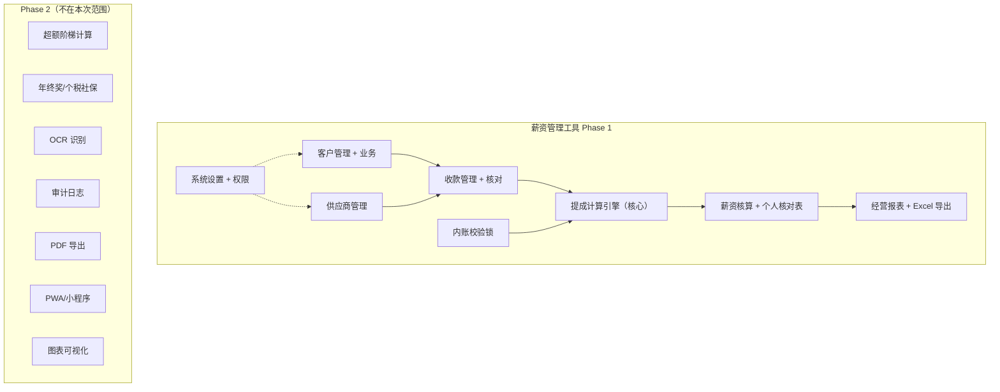

### 1.3 核心业务对象关系（概念层）

> **核心设计决策**：引入 **Bill（账单）** 实体作为业务与收款之间的纽带。
> - 长期业务（Subscription）按账期自动生成账单（月付→每月1张，年付→每年1张）
> - 一次性业务（OneTimeProject）创建时即生成1张账单
> - 收款（PaymentRecord）关联到具体账单，而非直接关联业务
> - 账单承载"应收金额""应收月份""已收金额""欠费状态"等核心计算属性

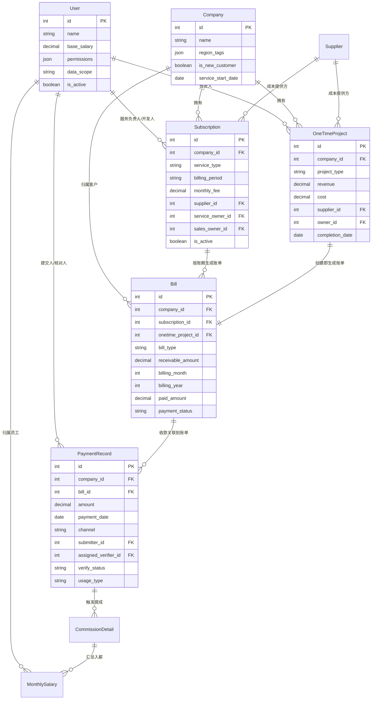

**账单核心流程（概念）：**

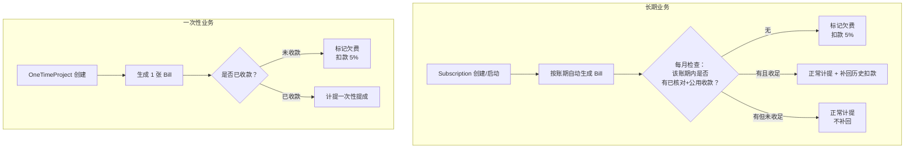

### 1.4 核心业务流程概要（端到端）

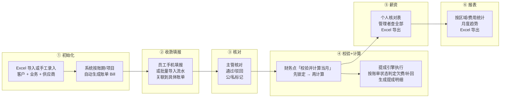

### 1.5 关键业务规则摘要（SRS §4 对应）

| 规则 | 核心逻辑 | Phase 1 状态 |
|------|---------|-------------|
| 服务提成 | 月费 × 15%，服务当月计提，欠费扣月费×5% | ✅ 计算 |
| 销售提成 | 收款金额 × 15%，收款当月计提，12月窗口限制 | ✅ 计算 |
| 一次性提成 | 毛利 × 20%，完成月计提，未收款扣毛利×5% | ✅ 计算 |
| 补回 | 收足当月一次性补回之前所有扣款总额 | ✅ 计算 |
| 超额阶梯 | 提成超额部分阶梯奖励 | ❌ 仅配置不计算 |
| 年终奖/个税社保 | — | ❌ 仅预留字段 |
| 私用排除 | 私人费用完全不参与任何计算 | ✅ 实现 |
| 离职停发 | is_active=false 次月停提成 | ✅ 实现 |
| 内账锁 | 校验并计算 → 锁定+计算，最近月可撤销 | ✅ 实现 |

### 1.6 角色与功能矩阵（RACU）

| 功能模块 | 员工 | 主管 | 财务 | 老板 |
|---------|------|------|------|------|
| 客户管理 | — | — | — | 配置(ALL) |
| 供应商管理 | — | — | — | 配置(ALL) |
| 收款填报 | ✅ 提交 | — | — | ✅ 提交(ALL) |
| 收款核对 | — | ✅ 核对自己 | ✅ 核对自己 | ✅ 全部 |
| 内账校验+计算 | — | — | ✅ 触发 | ✅ 触发 |
| 薪资查看 | 自己 | 自己 | 全部 | 全部 |
| 经营报表 | 自己负责业务 | 自己负责业务 | 全部 | 全部 |
| 系统设置 | — | — | — | ✅ 全部 |
| Excel 导入/导出 | — | — | ✅ 导出 | ✅ 导入+导出 |

### 1.7 约束与风险

**约束：**
- 技术栈：Vue 3 + Element Plus + FastAPI + MySQL 8.0 + SQLAlchemy 2.0
- Phase 1 仅 Web 端，移动端适配三个页面（填报/核对/查看）
- Phase 2 通过 uni-app 开发微信小程序，API 接口需保持统一
- 不引入消息队列、缓存中间件等额外基础设施（小团队无需）
- Phase 1 不做 OCR、图表可视化、PDF、审计日志

**风险：**

| 风险 | 影响 | 缓解 |
|------|------|------|
| 提成引擎逻辑复杂（欠费+补回跨月交互） | 计算错误 | 基于账单模型简化判定，单元测试覆盖 |
| 账单生成机制（按账期自动展开） | 漏生成/重复生成 | 定时任务 + 幂等校验 |
| 批量导入格式适配（不同银行/微信格式） | 导入失败率高 | 统一模板 + 人工兜底关联 |
| 月费历史记录（生效日期机制） | 数据模型复杂 | 设计阶段引入月费变更历史表 |
| 内账锁撤销重算 | 数据一致性 | 状态锁 + 幂等计算设计 |
| 前后端分离 + 未来小程序复用 | API 设计需前瞻性 | 接口统一 RESTful，小程序直接复用 |
| MySQL 运维（vs SQLite） | 部署复杂度增加 | 提供 Docker Compose 一键部署 |

---

## 第 2 步：系统总体架构设计

### 2.1 架构风格

采用 **前后端分离 + 单体应用** 架构：

- **后端**：FastAPI 单体应用，按业务模块组织代码包（不拆微服务，小团队无需）
- **前端**：Vue 3 SPA 单页应用，Vite 构建
- **数据库**：MySQL 8.0 单实例
- **部署**：Nginx 反向代理 → 前端静态文件 + 后端 API
- **未来扩展**：Phase 2 uni-app 小程序复用同一套 API

### 2.2 系统总体架构图

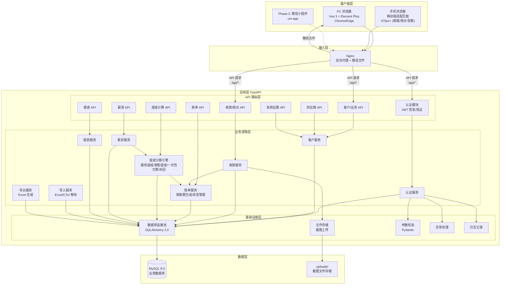

### 2.3 后端分层架构

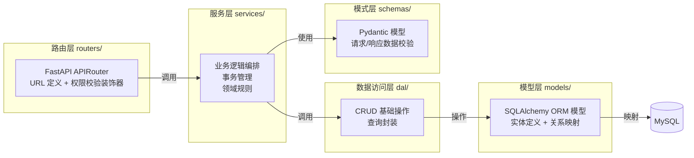

### 2.4 前端架构

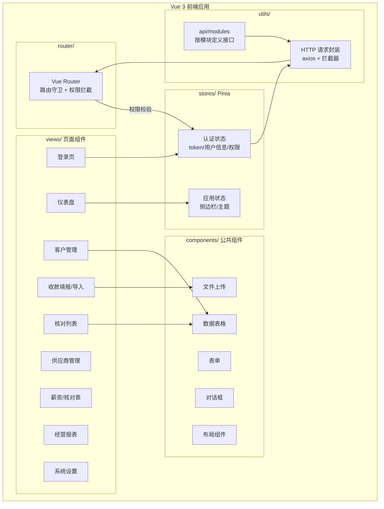

### 2.5 请求处理链路

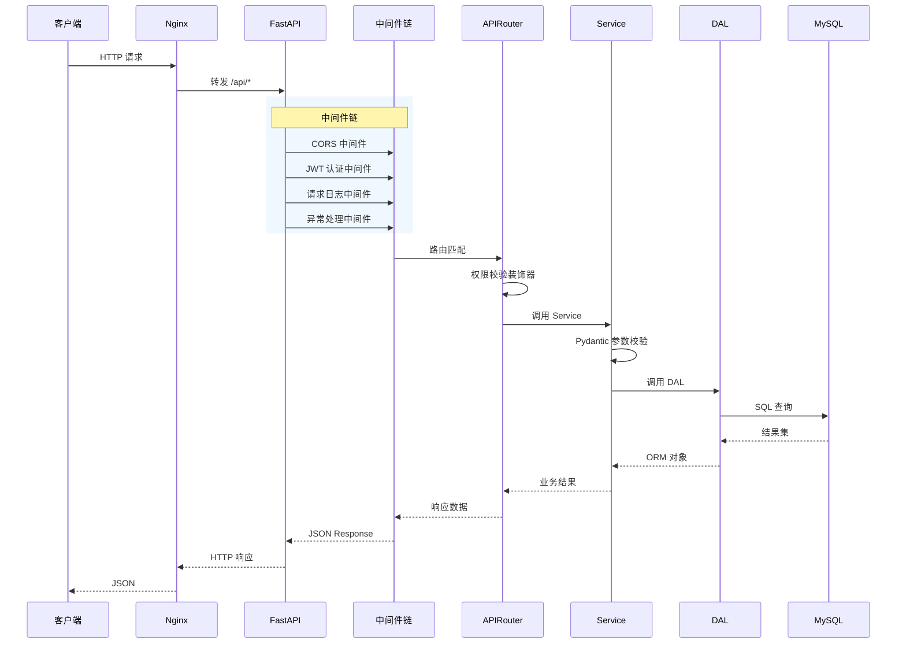

### 2.6 跨端 API 复用策略

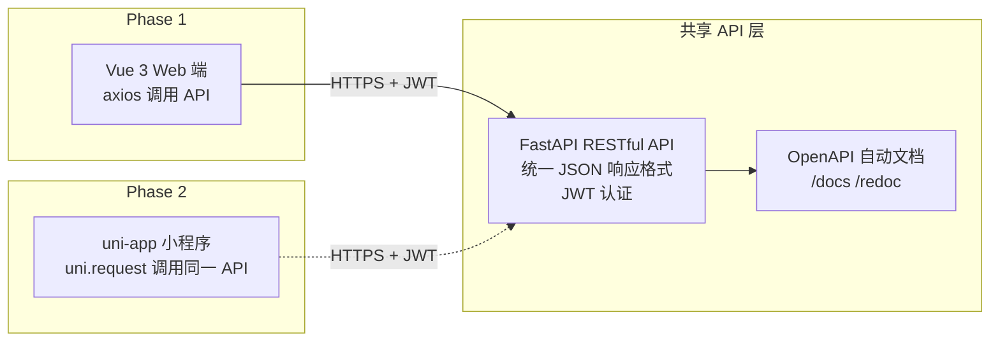

**API 设计原则（为跨端复用）：**
- 统一 RESTful 风格，资源命名规范
- 统一 JSON 响应格式：`{ code, message, data }`
- 统一 JWT 认证（Authorization: Bearer token）
- 统一分页格式：`{ items, total, page, page_size }`
- 统一错误码体系
- 文件上传统一 multipart/form-data

### 2.7 目录结构规划

```
salary-manager/
├── backend/                    # 后端
│   ├── app/
│   │   ├── main.py            # FastAPI 应用入口
│   │   ├── config.py          # 配置（数据库/JWT/文件路径）
│   │   ├── database.py        # SQLAlchemy 引擎 + Session
│   │   ├── models/            # ORM 模型
│   │   │   ├── user.py
│   │   │   ├── company.py
│   │   │   ├── subscription.py
│   │   │   ├── onetime_project.py
│   │   │   ├── bill.py
│   │   │   ├── payment.py
│   │   │   ├── supplier.py
│   │   │   ├── commission.py
│   │   │   ├── salary.py
│   │   │   └── ledger.py
│   │   ├── schemas/           # Pydantic 请求/响应模型
│   │   ├── routers/           # API 路由
│   │   ├── services/          # 业务逻辑
│   │   ├── dal/               # 数据访问层
│   │   ├── core/              # 核心（认证/权限/异常/日志）
│   │   └── utils/             # 工具（Excel导入导出等）
│   ├── alembic/               # 数据库迁移
│   ├── tests/                 # 测试
│   ├── requirements.txt
│   └── alembic.ini
├── frontend/                   # 前端
│   ├── src/
│   │   ├── main.js
│   │   ├── App.vue
│   │   ├── router/            # 路由
│   │   ├── stores/            # Pinia 状态
│   │   ├── views/             # 页面
│   │   ├── components/         # 公共组件
│   │   ├── api/                # 接口定义
│   │   ├── utils/             # 工具函数
│   │   └── assets/            # 静态资源
│   ├── public/
│   ├── index.html
│   ├── vite.config.js
│   └── package.json
├── docker-compose.yml          # 一键部署
├── nginx.conf                  # Nginx 配置
└── README.md
```

### 2.8 部署架构

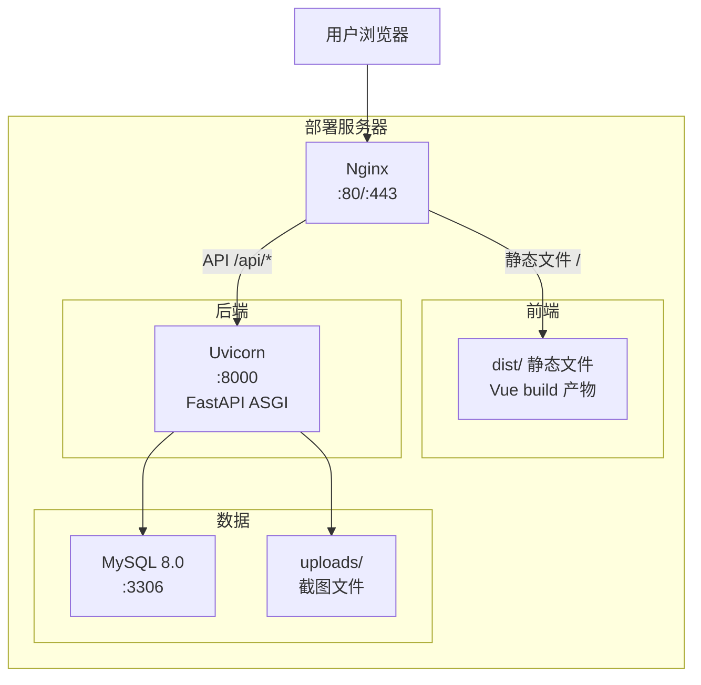

**部署方案（Docker Compose 一键部署）：**
- `nginx` 容器：前端静态文件 + 反向代理
- `backend` 容器：Uvicorn 运行 FastAPI
- `mysql` 容器：MySQL 8.0 + 数据卷持久化
- `uploads` 卷：截图文件持久化

### 2.9 架构约束与决策

| 决策项 | 选择 | 理由 |
|-------|------|------|
| 架构风格 | 前后端分离单体 | 小团队无需微服务，单体够用 |
| API 风格 | RESTful + JWT | 跨端复用（Web/小程序） |
| ORM | SQLAlchemy 2.0 | 成熟、支持 MySQL、Alembic 迁移 |
| 数据库迁移 | Alembic | SQLAlchemy 标配 |
| 前端构建 | Vite | 极速 HMR，Vue 3 推荐 |
| 状态管理 | Pinia | Vue 3 官方推荐 |
| 部署 | Docker Compose | 一键部署，降低运维门槛 |
| 缓存 | 不引入（Phase 1） | 小团队低频操作，MySQL 足够 |
| 消息队列 | 不引入（Phase 1） | 无异步需求，定时任务用 APScheduler |
| 文件存储 | 本地磁盘 | 小规模截图文件，无需对象存储 |

### 2.10 风险点

| 风险 | 影响 | 缓解 |
|------|------|------|
| MySQL 单实例无主从 | 单点故障 | 定期备份 + 可后续升级主从 |
| 本地文件存储无冗余 | 磁盘故障丢截图 | 定期备份 uploads 目录 |
| 后端单体应用膨胀 | 代码耦合 | 严格按分层架构组织，Service 之间通过接口调用 |
| 前端未做 SSR | SEO 不友好 | 内部系统无需 SEO，SPA 够用 |

---

> ✅ 第 1-2 步已完成确认

---

## 第 3 步：领域实体与顶层数据模型

### 3.1 领域划分

系统分为 **6 个核心领域** + 2 个支撑领域：

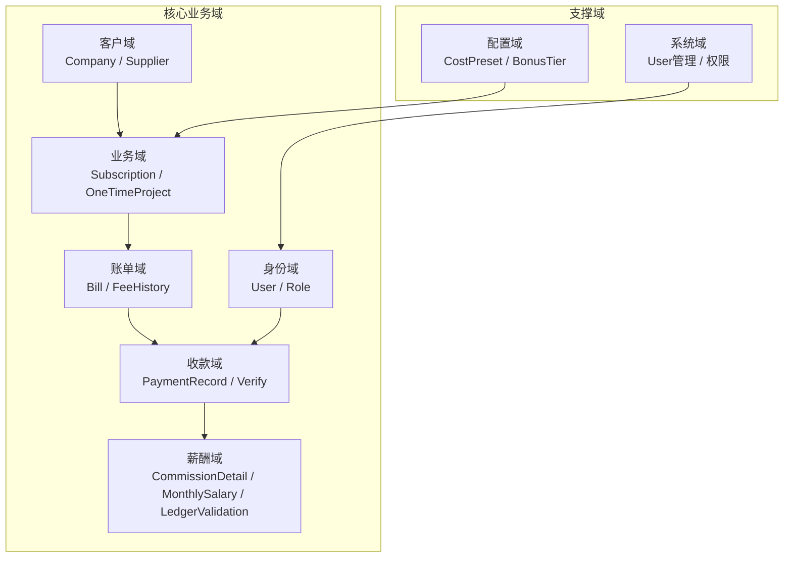

### 3.2 领域实体清单

| # | 实体 | 所属域 | 中文名 | 说明 |
|---|------|--------|--------|------|
| 1 | User | 身份域 | 用户 | 系统用户，一人可持多角色 |
| 2 | Company | 客户域 | 客户 | 服务对象企业 |
| 3 | Supplier | 客户域 | 供应商 | 成本提供方 |
| 4 | Subscription | 业务域 | 长期业务 | 按账期循环计费的长期服务 |
| 5 | OneTimeProject | 业务域 | 一次性业务 | 单次项目 |
| 6 | FeeHistory | 账单域 | 月费变更历史 | 记录月费调整，按生效日期取值 |
| 7 | Bill | 账单域 | 账单 | 业务与收款的纽带，按账期生成 |
| 8 | PaymentRecord | 收款域 | 收款记录 | 员工填报或批量导入的收款 |
| 9 | PaymentBillAllocation | 收款域 | 收款账单分配 | ⭐ 收款与账单的多对多关联表，记录分配金额 |
| 10 | PaymentScreenshot | 收款域 | 收款截图 | 收款凭证图片 |
| 11 | CustomerPrepayment | 收款域 | 客户预付款 | ⭐ 多交款项自动转为预付，下月自动抵扣 |
| 12 | CommissionDetail | 薪酬域 | 提成明细 | 单笔提成记录，可追溯 |
| 13 | MonthlySalary | 薪酬域 | 月度薪资 | 员工月度薪资汇总 |
| 14 | LedgerValidation | 薪酬域 | 内账校验锁 | 月度锁定记录 |
| 15 | CostPreset | 配置域 | 成本预设 | 业务类型→默认成本映射 |
| 16 | BonusTier | 配置域 | 超额阶梯配置 | Phase 1 仅配置不计算 |

> ⭐ **v3 新增实体**：PaymentBillAllocation（收款账单分配表）、CustomerPrepayment（客户预付款表）——源于设计阶段补充确认的"收款与账单多对多 + 预付款"需求。

### 3.3 实体关系图（完整 ER）

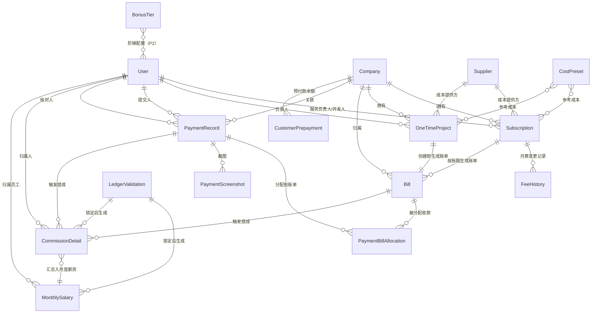

### 3.4 实体详细定义（概念层）

#### 3.4.1 User（用户）

| 属性 | 类型 | 说明 |
|------|------|------|
| id | int PK | 主键 |
| username | string | 登录用户名（唯一） |
| password_hash | string | bcrypt 哈希密码 |
| name | string | 真实姓名 |
| base_salary | decimal(10,2) | 固定底薪 |
| permissions | json | 权限点列表，如 `["payment:submit","salary:view"]` |
| data_scope | enum | SELF / ALL |
| is_active | boolean | 是否在职（true=在职，false=离职） |
| is_admin | boolean | 是否超管（首次初始化用） |
| created_at | datetime | 创建时间 |
| updated_at | datetime | 更新时间 |

> **关系基数**：1 User → 0..N Subscription（作为服务负责人或开发人）；1 User → 0..N PaymentRecord（作为提交人或核对人）

#### 3.4.2 Company（客户）

| 属性 | 类型 | 说明 |
|------|------|------|
| id | int PK | 主键 |
| name | string | 客户名称 |
| region_tags | json | 区域标签（扁平），如 `["广州","佛山"]` |
| is_new_customer | boolean | 是否新客（影响销售提成 12 月窗口） |
| service_start_date | date | 服务开始日期（销售提成 12 月计时起点） |
| remark | text | 备注 |
| is_archived | boolean | 软删除标记（有未结清时禁止删） |
| created_at | datetime | — |
| updated_at | datetime | — |

> **删除约束**：有未收款/未结清账单时禁止删除；否则软删除（is_archived=true）

#### 3.4.3 Supplier（供应商）

| 属性 | 类型 | 说明 |
|------|------|------|
| id | int PK | 主键 |
| name | string | 供应商名称 |
| type | enum | 刻章/地址挂靠/审计/其他 |
| contact | string | 联系方式 |
| remark | text | 备注 |
| is_archived | boolean | 软删除标记 |
| created_at | datetime | — |
| updated_at | datetime | — |

#### 3.4.4 Subscription（长期业务）

| 属性 | 类型 | 说明 |
|------|------|------|
| id | int PK | 主键 |
| company_id | int FK | 关联客户 |
| service_type | string | 服务类型（如代理记账） |
| billing_period | enum | 月/季/半年/年 |
| monthly_fee | decimal(10,2) | 当前月费（历史变更见 FeeHistory） |
| is_cost_type | boolean | 是否成本类业务 |
| monthly_cost | decimal(10,2) | 月成本 |
| supplier_id | int FK | 关联供应商（可空） |
| service_owner_id | int FK | 服务负责人（→服务提成） |
| sales_owner_id | int FK | 开发人（→销售提成） |
| start_date | date | 业务开始日期 |
| is_active | boolean | 启停状态 |
| is_archived | boolean | 软删除标记 |
| created_at | datetime | — |
| updated_at | datetime | — |

> **月费取值规则**：计算某月提成时，取 FeeHistory 中该 Subscription 在该月生效的月费记录。若无变更记录，取 Subscription.monthly_fee。

#### 3.4.5 FeeHistory（月费变更历史）

| 属性 | 类型 | 说明 |
|------|------|------|
| id | int PK | 主键 |
| subscription_id | int FK | 关联长期业务 |
| old_fee | decimal(10,2) | 旧月费 |
| new_fee | decimal(10,2) | 新月费 |
| effective_date | date | 生效日期（该日起按 new_fee 计算） |
| changed_by | int FK | 操作人（User） |
| created_at | datetime | — |

#### 3.4.6 OneTimeProject（一次性业务）

| 属性 | 类型 | 说明 |
|------|------|------|
| id | int PK | 主键 |
| company_id | int FK | 关联客户 |
| project_type | string | 业务类型 |
| revenue | decimal(10,2) | 收入 |
| cost | decimal(10,2) | 成本 |
| gross_profit | decimal(10,2) | 毛利（= revenue - cost，计算字段） |
| supplier_id | int FK | 关联供应商（可空） |
| owner_id | int FK | 负责人（→一次性提成） |
| completion_date | date | 完成日期 |
| is_received | boolean | 是否已收款 |
| receive_date | date | 收款日期 |
| is_archived | boolean | 软删除标记 |
| created_at | datetime | — |
| updated_at | datetime | — |

#### 3.4.7 Bill（账单）⭐ 核心实体

| 属性 | 类型 | 说明 |
|------|------|------|
| id | int PK | 主键 |
| company_id | int FK | 关联客户 |
| subscription_id | int FK | 关联长期业务（可空，与 onetime_project_id 互斥） |
| onetime_project_id | int FK | 关联一次性业务（可空，与 subscription_id 互斥） |
| bill_type | enum | subscription / onetime |
| billing_year | int | 账单年份 |
| billing_month | int | 账单月份（1-12） |
| receivable_amount | decimal(10,2) | 应收金额（月费 / 毛利 / 项目款） |
| paid_amount | decimal(10,2) | 已收金额（累计已核对+公用收款） |
| payment_status | enum | unpaid / partial / paid / overdue |
| is_overdue | boolean | 是否欠费（用于欠费判定） |
| created_at | datetime | — |
| updated_at | datetime | — |

> **账单状态机**：`unpaid`（未收）→ `partial`（部分收）→ `paid`（收足）；当计算月到达且 unpaid → `overdue`（欠费）
>
> **幂等约束**：(subscription_id, billing_year, billing_month) 唯一索引，防止重复生成
>
> **账期展开规则**：
> - 月付：每月生成 1 张账单
> - 季付：每季生成 1 张账单（覆盖 3 个月）
> - 半年付：每半年生成 1 张账单（覆盖 6 个月）
> - 年付：每年生成 1 张账单（覆盖 12 个月）
> - 一次性业务：创建时即生成 1 张账单

#### 3.4.8 PaymentRecord（收款记录）

| 属性 | 类型 | 说明 |
|------|------|------|
| id | int PK | 主键 |
| company_id | int FK | 关联客户 |
| amount | decimal(10,2) | 收款总金额 |
| payment_date | date | 收款日期 |
| channel | enum | 银行卡/微信/支付宝/对公/现金 |
| submitter_id | int FK | 提交人（User） |
| assigned_verifier_id | int FK | 核对人（User） |
| verify_status | enum | pending / approved / rejected |
| reject_reason | string | 驳回原因（rejected 时选填，需 2 次确认避免误操作） |
| usage_type | enum | public / private |
| remark | text | 备注 |
| created_at | datetime | — |
| updated_at | datetime | — |

> **v3 变更**：去掉了 bill_id 直接外键。收款与账单通过 PaymentBillAllocation 关联表实现多对多关系。
>
> **核对状态机**：`pending`（待核对）→ `approved`（通过）/ `rejected`（驳回）；驳回后可修改重提 → `pending`
>
> **私用排除**：usage_type=private 的记录完全不参与任何计算
>
> **多业务关联**：员工填报时选择客户后，可关联该客户下一张或多张账单，并分配金额（通过 PaymentBillAllocation）

#### 3.4.9 PaymentScreenshot（收款截图）

| 属性 | 类型 | 说明 |
|------|------|------|
| id | int PK | 主键 |
| payment_record_id | int FK | 关联收款记录 |
| file_path | string | 文件存储路径 |
| file_name | string | 原始文件名 |
| file_size | int | 文件大小（字节） |
| created_at | datetime | 上传时间 |

> **约束**：单张 ≤5MB，JPG/PNG，每条收款限传 3 张

#### 3.4.9b PaymentBillAllocation（收款账单分配）⭐ v3 新增

| 属性 | 类型 | 说明 |
|------|------|------|
| id | int PK | 主键 |
| payment_record_id | int FK | 关联收款记录 |
| bill_id | int FK | 关联账单 |
| allocation_amount | decimal(10,2) | 分配到该账单的金额 |
| created_at | datetime | — |

> **多对多关系**：一笔 PaymentRecord 可关联多条 PaymentBillAllocation（一笔收款拆分到多个账单）；一张 Bill 也可有多条 PaymentBillAllocation（多笔收款凑齐一张账单）
>
> **约束**：一笔收款的所有 allocation_amount 之和 ≤ 该收款 amount；差额自动转入 CustomerPrepayment

#### 3.4.9c CustomerPrepayment（客户预付款）⭐ v3 新增

| 属性 | 类型 | 说明 |
|------|------|------|
| id | int PK | 主键 |
| company_id | int FK | 关联客户 |
| balance | decimal(10,2) | 当前预付余额 |
| source | enum | overpayment（多交转入）/ manual（手动充值） |
| remark | text | 备注 |
| created_at | datetime | — |
| updated_at | datetime | — |

> **预付款逻辑**：
> - 收款核对通过后，若分配到账单的金额之和 < 收款金额，差额自动转入该客户的 CustomerPrepayment.balance
> - 下月生成新账单时，系统自动检查该客户是否有预付余额，有则自动抵扣（创建一条 PaymentBillAllocation，source=prepayment）
> - 预付款抵扣不影响提成计算（相当于已收款）

#### 3.4.10 CommissionDetail（提成明细）

| 属性 | 类型 | 说明 |
|------|------|------|
| id | int PK | 主键 |
| user_id | int FK | 归属员工 |
| commission_type | enum | service / sales / onetime |
| bill_id | int FK | 来源账单 |
| payment_record_id | int FK | 来源收款（可空，服务提成无直接收款） |
| company_id | int FK | 来源客户 |
| subscription_id | int FK | 来源长期业务（可空） |
| onetime_project_id | int FK | 来源一次性业务（可空） |
| billing_year | int | 计提年 |
| billing_month | int | 计提月 |
| base_amount | decimal(10,2) | 计算基数（月费/收款金额/毛利） |
| rate | decimal(5,4) | 比例（0.15 / 0.20） |
| commission_amount | decimal(10,2) | 提成金额（= base × rate） |
| deduction_amount | decimal(10,2) | 欠费扣款金额（负项，0 表示无扣款） |
| supplement_amount | decimal(10,2) | 补回金额（正项，0 表示无补回） |
| net_amount | decimal(10,2) | 净额（= commission - deduction + supplement） |
| is_supplement | boolean | 是否为补回记录 |
| created_at | datetime | — |

> **可追溯性**：每笔提成可追溯到来源客户、业务、账单、收款
>
> **补回记录**：is_supplement=true 时，commission_amount=0，supplement_amount>0

#### 3.4.11 MonthlySalary（月度薪资）

| 属性 | 类型 | 说明 |
|------|------|------|
| id | int PK | 主键 |
| user_id | int FK | 归属员工 |
| salary_year | int | 薪资年 |
| salary_month | int | 薪资月 |
| base_salary | decimal(10,2) | 底薪（从 User 带出） |
| service_commission | decimal(10,2) | 服务提成合计 |
| sales_commission | decimal(10,2) | 销售提成合计 |
| onetime_commission | decimal(10,2) | 一次性提成合计 |
| total_deduction | decimal(10,2) | 欠费扣款合计 |
| total_supplement | decimal(10,2) | 补回合计 |
| bonus_amount | decimal(10,2) | 超额奖励（P2，P1=0） |
| gross_payable | decimal(10,2) | **应发合计** |
| year_end_bonus | decimal(10,2) | 年终奖（P1 预留=0） |
| tax_amount | decimal(10,2) | 个税（P1 预留=0） |
| social_insurance | decimal(10,2) | 社保（P1 预留=0） |
| housing_fund | decimal(10,2) | 公积金（P1 预留=0） |
| ledger_validation_id | int FK | 关联校验锁记录 |
| created_at | datetime | — |

> **应发公式**：gross_payable = base_salary + service_commission + sales_commission + onetime_commission + total_supplement - total_deduction
> （bonus_amount / year_end_bonus / tax 等 P1 不计算 = 0）

#### 3.4.12 LedgerValidation（内账校验锁）

| 属性 | 类型 | 说明 |
|------|------|------|
| id | int PK | 主键 |
| ledger_year | int | 锁定年 |
| ledger_month | int | 锁定月 |
| status | enum | locked / unlocked / calculating |
| locked_by | int FK | 锁定操作人（User） |
| locked_at | datetime | 锁定时间 |
| unlocked_by | int FK | 撤销操作人（可空） |
| unlocked_at | datetime | 撤销时间（可空） |
| calculation_status | enum | idle / running / completed / failed |
| created_at | datetime | — |
| updated_at | datetime | — |

> **状态规则**：
> - `unlocked` → 财务点击"校验并计算当月" → `calculating`（计算中）→ `locked`（计算完成自动锁定）
> - `locked` → 最近一月可撤销 → `unlocked`；历史月不可撤销
> - `calculating` 状态时禁止重复触发（简单状态锁）

#### 3.4.13 CostPreset（成本预设）

| 属性 | 类型 | 说明 |
|------|------|------|
| id | int PK | 主键 |
| business_type | string | 业务类型（唯一约束） |
| default_cost | decimal(10,2) | 默认成本 |
| is_active | boolean | 启用状态 |
| created_at | datetime | — |
| updated_at | datetime | — |

#### 3.4.14 BonusTier（超额阶梯配置）

| 属性 | 类型 | 说明 |
|------|------|------|
| id | int PK | 主键 |
| tier_name | string | 阶梯名称 |
| min_amount | decimal(10,2) | 提成总额下限（含） |
| max_amount | decimal(10,2) | 提成总额上限（不含，null=无上限） |
| bonus_rate | decimal(5,4) | 奖励比例 |
| is_active | boolean | 启用状态 |
| sort_order | int | 排序（从小到大） |
| created_at | datetime | — |
| updated_at | datetime | — |

> Phase 1 仅维护配置，计算引擎不应用。Phase 2 实现"超额累进"算法。

### 3.5 领域边界与依赖关系

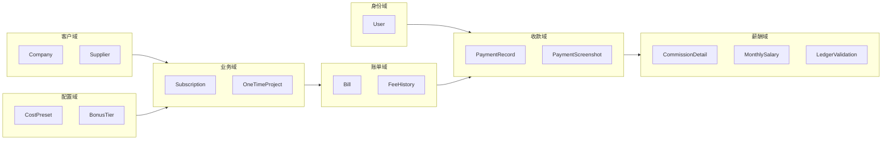

**领域依赖规则：**
- 身份域：无依赖（基础域）
- 客户域：依赖身份域（无直接关联，但 Supplier 被 Subscription 引用）
- 业务域：依赖客户域
- 账单域：依赖业务域
- 收款域：依赖账单域 + 身份域
- 薪酬域：依赖收款域 + 账单域
- 配置域：被业务域引用

### 3.6 关键设计约束

| 约束 | 规则 |
|------|------|
| Bill 唯一性 | (subscription_id, billing_year, billing_month) 唯一索引 |
| Bill 互斥关联 | subscription_id 和 onetime_project_id 互斥（恰好一个非空） |
| PaymentRecord 必须关联 Bill | bill_id 非空（员工填报时关联业务必填的体现） |
| 私用排除 | usage_type=private 的收款不触发任何 CommissionDetail |
| 离职停发 | CommissionDetail 只为 is_active=true 的 User 生成 |
| 月费历史 | 提成计算时取 FeeHistory 中生效日期最近的记录 |
| 软删除 | Company / Subscription / OneTimeProject / Supplier 用 is_archived 标记 |
| 硬删除禁止 | 有未结清账单的实体禁止任何形式的删除 |
| 内账锁 | LedgerValidation status=locked 时禁止新增/修改该月收款 |

### 3.7 风险点

| 风险 | 影响 | 缓解 |
|------|------|------|
| Bill 幂等生成（重复执行定时任务） | 重复账单 | 数据库唯一索引 + 应用层幂等检查 |
| FeeHistory 与 Subscription.monthly_fee 不一致 | 月费取值错误 | 新建 Subscription 时同步创建 FeeHistory 初始记录 |
| CommissionDetail 数据量大 | 查询变慢 | 按 (user_id, billing_year, billing_month) 建索引 |
| LedgerValidation 撤销重算 | 数据一致性 | 撤销时删除该月 CommissionDetail + MonthlySalary，重新计算 |

---

> ✅ 第 3 步完成

---

## 第 4 步：业务模块拆分与职责边界

### 4.1 模块拆分原则

按 **领域驱动** 拆分后端模块，每个模块对应一个领域，包含独立的 router、service、dal、models、schemas。模块间通过 Service 层接口调用，避免跨模块直接操作 DAL。

### 4.2 模块总览

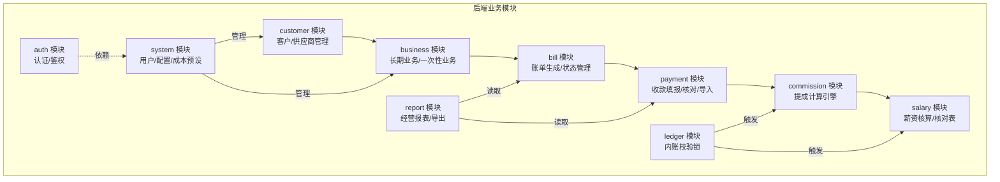

### 4.3 各模块职责边界

#### 模块 1：auth（认证模块）

| 项 | 说明 |
|----|------|
| 职责 | 用户登录、JWT 签发与验证、密码哈希、权限校验 |
| 对外接口 | POST /api/auth/login、GET /api/auth/me、PUT /api/auth/password |
| 依赖模块 | system（读取用户信息） |
| 核心逻辑 | bcrypt 哈希验证 → JWT 签发 → 权限点列表存入 token |
| 边界 | 不处理用户 CRUD（由 system 模块负责）；不处理业务逻辑 |

#### 模块 2：customer（客户模块）

| 项 | 说明 |
|----|------|
| 职责 | 客户 CRUD、供应商 CRUD、Excel 批量导入客户 |
| 对外接口 | /api/customers/*、/api/suppliers/*、/api/customers/import |
| 依赖模块 | 无（基础模块） |
| 核心逻辑 | 软删除检查（有未结清账单禁止归档）；区域标签 JSON 管理 |
| 边界 | 不管理业务（业务由 business 模块负责）；不处理收款 |

#### 模块 3：business（业务模块）

| 项 | 说明 |
|----|------|
| 职责 | 长期业务 CRUD、一次性业务 CRUD、月费变更历史管理 |
| 对外接口 | /api/subscriptions/*、/api/onetime-projects/*、/api/subscriptions/{id}/fee-history |
| 依赖模块 | customer（关联客户/供应商） |
| 核心逻辑 | 月费变更时自动创建 FeeHistory；业务启停控制 |
| 边界 | 不生成账单（由 bill 模块负责）；不计算提成 |

#### 模块 4：bill（账单模块）⭐

| 项 | 说明 |
|----|------|
| 职责 | 按账期自动生成账单、账单状态管理、欠费判定 |
| 对外接口 | /api/bills/*、POST /api/bills/generate（手动触发生成） |
| 依赖模块 | business（读取业务信息）、customer（关联客户） |
| 核心逻辑 | 定时任务按账期生成 Bill；幂等检查（唯一索引）；paid_amount 实时更新 |
| 边界 | 不处理收款（由 payment 模块负责）；收款核对通过后由 payment 模块回调更新 paid_amount |
| 跨模块协作 | payment 模块核对通过后 → 调用 bill.update_paid_amount(bill_id) |

#### 模块 5：payment（收款模块）

| 项 | 说明 |
|----|------|
| 职责 | 收款填报、截图上传、核对流程、批量导入流水 |
| 对外接口 | /api/payments/*、/api/payments/upload、/api/payments/import、/api/payments/{id}/verify |
| 依赖模块 | bill（关联账单）、auth（提交人/核对人） |
| 核心逻辑 | 核对状态机（pending→approved/rejected）；私用标记排除；批量导入后自动匹配客户 |
| 边界 | 不计算提成；核对通过后通知 bill 模块更新账单 |
| 跨模块协作 | 核对通过 + 公用 → 调用 bill.update_paid_amount() → commission 引擎读取 |

#### 模块 6：commission（提成计算引擎）⭐

| 项 | 说明 |
|----|------|
| 职责 | 三种提成计算、欠费扣款、补回计算、生成 CommissionDetail |
| 对外接口 | POST /api/commissions/calculate（内部由 ledger 触发，不直接暴露） |
| 依赖模块 | bill（读取账单状态）、payment（读取已核对收款）、business（读取业务配置） |
| 核心逻辑 | **计算引擎核心**，详见伪代码 |
| 边界 | 不管理薪资汇总（由 salary 模块负责）；不触发内账锁 |

**提成引擎计算伪代码：**

```
FUNCTION calculate_commissions(year, month):
    # 1. 获取当月所有活跃员工
    active_users = SELECT * FROM User WHERE is_active = true

    # 2. 获取当月所有账单
    bills = SELECT * FROM Bill WHERE billing_year = year AND billing_month = month

    FOR each bill IN bills:
        IF bill.bill_type == 'subscription':
            # 服务提成
            sub = bill.subscription
            fee = get_effective_fee(sub.id, year, month)  # 从 FeeHistory 取
            commission = fee * 0.15
            owner = sub.service_owner_id

            # 欠费判定
            IF bill.payment_status == 'unpaid' OR bill.payment_status == 'overdue':
                deduction = fee * 0.05
            ELSE:
                deduction = 0

            # 补回判定
            IF bill.payment_status == 'paid':
                supplement = get_history_deductions(bill.company_id, sub.id, year, month)
            ELSE:
                supplement = 0

            CREATE CommissionDetail(user_id=owner, type='service', ...)

            # 销售提成（12月窗口内）
            IF sub.company.is_new_customer AND in_sales_window(sub.company.service_start_date, year, month):
                sales_payments = get_approved_public_payments(bill.id, year, month)
                FOR each payment IN sales_payments:
                    sales_commission = payment.amount * 0.15
                    CREATE CommissionDetail(user_id=sub.sales_owner_id, type='sales', ...)

        ELSE IF bill.bill_type == 'onetime':
            # 一次性提成
            proj = bill.onetime_project
            gross_profit = proj.revenue - proj.cost
            commission = gross_profit * 0.20
            owner = proj.owner_id

            # 欠费判定（未收款）
            IF NOT proj.is_received:
                deduction = gross_profit * 0.05
            ELSE:
                deduction = 0

            CREATE CommissionDetail(user_id=owner, type='onetime', ...)
```

#### 模块 7：salary（薪资模块）

| 项 | 说明 |
|----|------|
| 职责 | 月度薪资汇总、个人核对表、Excel 导出薪资单 |
| 对外接口 | /api/salaries/*、/api/salaries/{user_id}/{year}/{month}、/api/salaries/export |
| 依赖模块 | commission（读取提成明细）、auth（读取底薪） |
| 核心逻辑 | 汇总 CommissionDetail → 计算 gross_payable → 生成 MonthlySalary |
| 边界 | 不计算提成（由 commission 模块负责）；不触发校验锁 |

#### 模块 8：ledger（内账校验锁模块）

| 项 | 说明 |
|----|------|
| 职责 | 月度锁定、撤销锁定、触发计算 |
| 对外接口 | POST /api/ledger/validate-and-calculate、POST /api/ledger/{id}/unlock |
| 依赖模块 | commission（触发计算）、salary（生成薪资）、payment（锁定后禁止写入） |
| 核心逻辑 | 状态锁 → 锁定收款 → 调用 commission.calculate → 调用 salary.generate → 标记 locked |
| 边界 | 不直接计算提成或薪资；只做编排（orchestration） |

**校验并计算流程：**

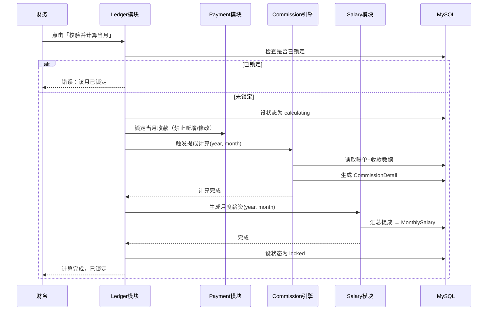

#### 模块 9：report（报表模块）

| 项 | 说明 |
|----|------|
| 职责 | 按区域统计、按费用统计、月度趋势、Excel 导出报表 |
| 对外接口 | /api/reports/region、/api/reports/cost、/api/reports/trend、/api/reports/export |
| 依赖模块 | payment（收款数据）、bill（账单数据）、customer（区域标签） |
| 核心逻辑 | 聚合查询 + Excel 生成 |
| 边界 | 只读模块，不修改任何数据 |

#### 模块 10：system（系统设置模块）

| 项 | 说明 |
|----|------|
| 职责 | 用户 CRUD、权限管理、底薪管理、成本预设、超额阶梯配置 |
| 对外接口 | /api/users/*、/api/cost-presets/*、/api/bonus-tiers/* |
| 依赖模块 | auth（权限校验） |
| 核心逻辑 | 用户管理含 is_active 控制（离职）；权限点 JSON 管理 |
| 边界 | 不处理认证逻辑（由 auth 模块负责） |

### 4.4 模块间调用规则

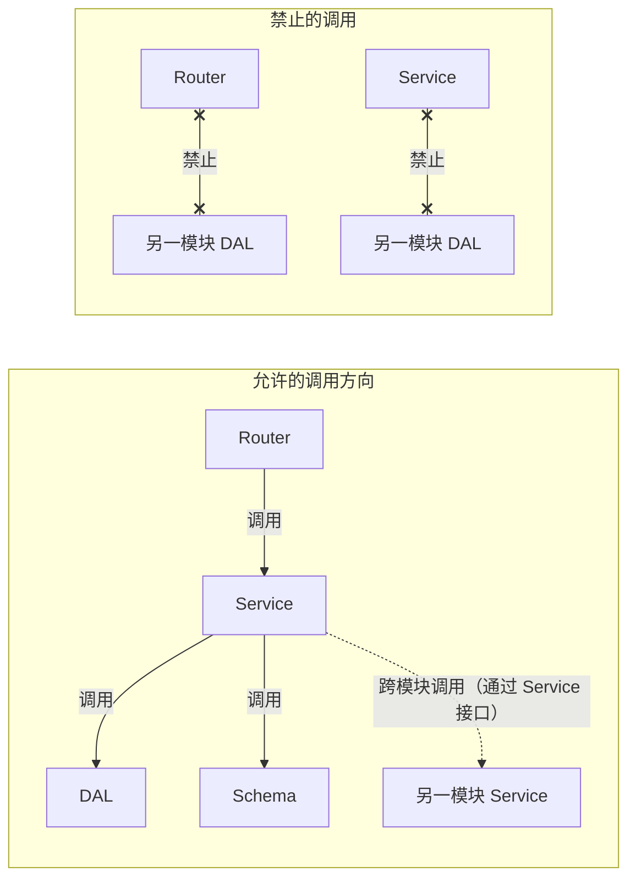

**调用规则：**
1. Router 只调用本模块的 Service
2. Service 可调用本模块的 DAL + Schema
3. Service 可调用**其他模块的 Service**（跨模块协作）
4. **禁止** Service 直接调用其他模块的 DAL（违反模块封装）
5. **禁止** Router 直接调用 DAL

### 4.5 跨模块协作矩阵

| 调用方 | 被调用方 | 协作场景 | 调用方式 |
|-------|---------|---------|---------|
| payment | bill | 核对通过后更新账单 paid_amount | bill_service.update_paid_amount(bill_id) |
| ledger | commission | 触发提成计算 | commission_service.calculate(year, month) |
| ledger | salary | 生成月度薪资 | salary_service.generate(year, month) |
| ledger | payment | 锁定当月收款 | payment_service.lock_month(year, month) |
| commission | bill | 读取账单状态 | bill_service.get_bills_for_month(year, month) |
| commission | business | 读取业务配置 | business_service.get_subscription(id) |
| salary | commission | 读取提成明细 | commission_service.get_details(user_id, year, month) |
| report | payment | 聚合收款数据 | payment_service.get_approved_payments(year, month) |
| report | bill | 聚合账单数据 | bill_service.get_bills_for_month(year, month) |

### 4.6 前端模块划分

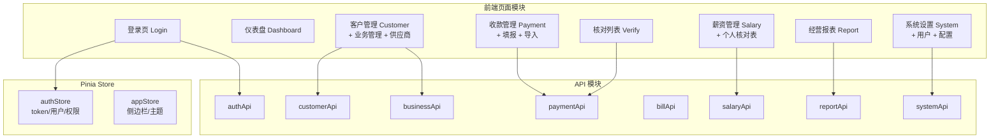

### 4.7 风险点

| 风险 | 影响 | 缓解 |
|------|------|------|
| commission 引擎跨模块依赖多 | 计算逻辑耦合 | 引擎通过 Service 接口读取数据，不直接操作其他模块 DAL |
| ledger 撤销重算的事务一致性 | 数据不一致 | 撤销操作在单个 DB 事务中：删除旧 CommissionDetail + MonthlySalary → 重新计算 |
| payment → bill 跨模块回调 | 账单 paid_amount 更新失败 | 使用同一事务，确保收款状态和账单状态一致 |
| 前端模块未做懒加载 | 首屏加载慢 | Vue Router 按路由懒加载，Vite 代码分割 |

---

> ✅ 第 4 步完成

---

## 第 5 步：前后端/服务间 API 接口设计

> 📄 **已拆分到独立文档**：`/workspace/接口设计文档.md`
>
> 该文档包含：
> - API 设计规范（统一响应格式、错误码、认证方式）
> - API 端点总览图（Mermaid）
> - 11 组接口共 40+ 端点的详细定义（方法/路径/权限/请求体/响应示例）
> - 收款填报支持多账单分配（bill_allocations）
> - 文件上传接口规范（截图 + Excel 导入）
> - 前端 API 调用层设计（axios 封装 + 拦截器）

---

> ✅ 第 5 步完成

---

## 第 6 步：详细数据库表结构设计

> 📄 **已拆分到独立文档**：`/workspace/数据库设计文档.md`
>
> 该文档包含：
> - 16 张表的完整 MySQL DDL（含 v3 新增的 payment_bill_allocations + customer_prepayments）
> - 完整 ER 关系图（Mermaid）
> - 索引汇总（17 个索引）
> - 外键约束汇总（20 个外键，含删除策略）
> - CHECK 约束 + 唯一约束
> - 账单状态转换图 + 收款核对状态机（Mermaid）
> - Alembic 迁移策略 + 初始化数据
> - 风险点

---

> ✅ 第 6 步完成，下一步：第 7 步 — 业务流程、单据状态机设计（输出到 `/workspace/业务流程设计文档.md`）


